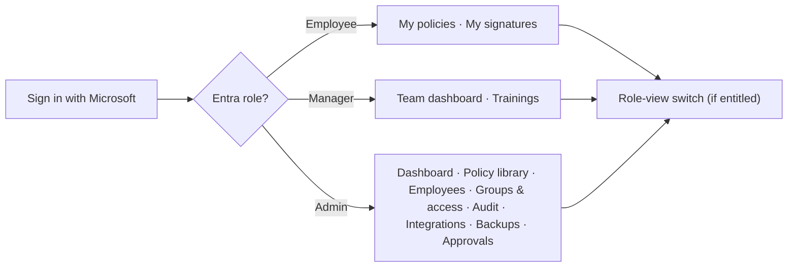
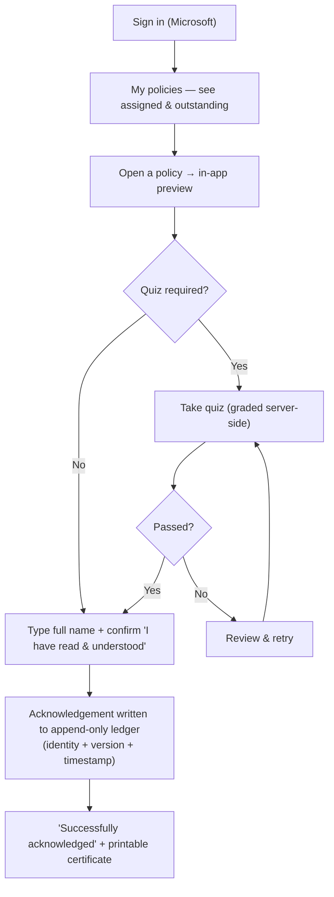
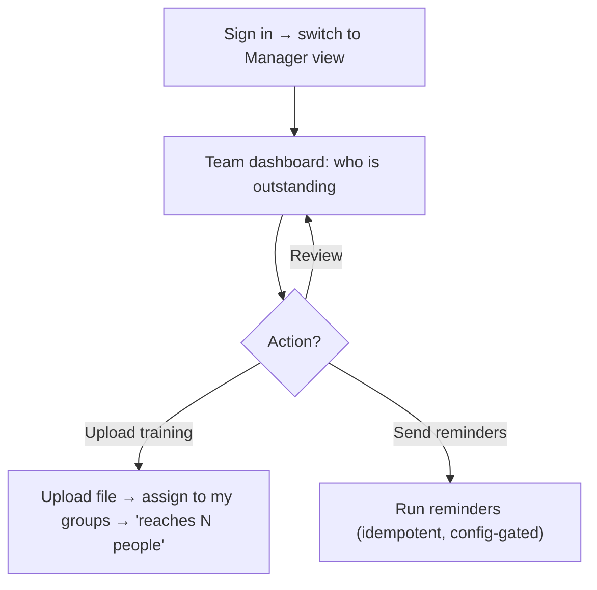
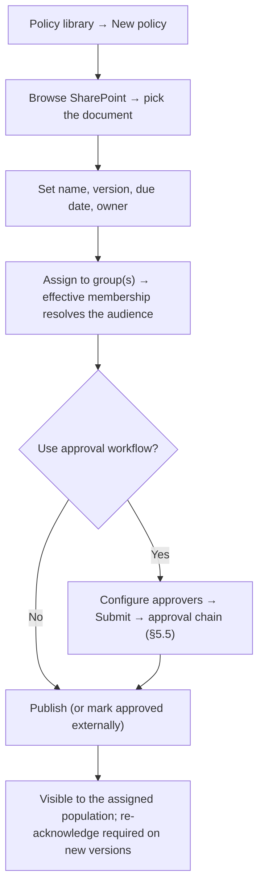
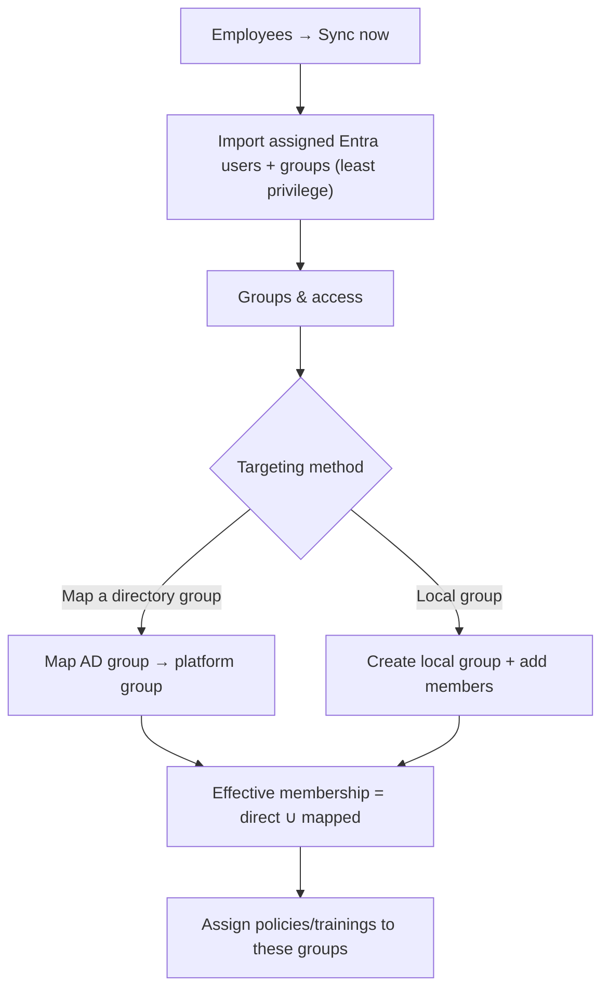
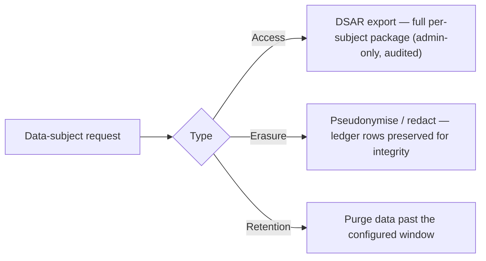

# Functional Flows & Features — Birgma Governance Portal

_A functional, **user-perspective** view of the application: what it does, the
features by area, and the step-by-step interaction flows each persona follows
(with diagrams). For the technical request path see
[`request-sequence.mmd`](request-sequence.mmd); for endpoints see [`LLD.md`](LLD.md);
for requirements see [`REQUIREMENTS.md`](REQUIREMENTS.md)._

---

## 1. What the application does

The portal makes sure the right people **read, understand and acknowledge** the right
governance documents — and produces defensible, tamper-evident **evidence** that they
did. Administrators publish policies (optionally behind an approval chain and a
knowledge check) and target them at groups; employees see only what applies to them,
read it in-app, pass any quiz, and sign; managers and administrators watch compliance
climb on live dashboards.

## 2. Personas & roles

| Persona | Sees | Primary goal |
|---|---|---|
| **Employee** | Their assigned policies, trainings, quizzes | Stay compliant — read & acknowledge |
| **Manager** | Their team's compliance + own trainings | Keep the team compliant |
| **Administrator** | Everything: authoring, groups, sync, reports, integrations | Publish & govern; run the platform |
| **Approver** | Items awaiting their decision | Sign off before publication |
| **DPO / Auditor** | Audit trail, DSAR export | Evidence & data-subject rights |
| **System / Scheduler** | — (unattended) | Reminders, sync, backups |

Roles come from Entra app roles; the SPA shows an **Employee / Manager / Admin** view
switch for users entitled to more than one.

## 3. Feature catalogue

| Area | Feature | Who | Where (screen · flow) |
|---|---|---|---|
| Identity | SSO sign-in, role-view switch, 15-min idle logout | All | Sign-in · §5.1 |
| Policy lifecycle | Create/edit/version/archive; SharePoint document source | Admin | Policy library · §5.4 |
| Document access | In-app preview (PDF/Office→PDF), download fallback | All (authorized) | Reader · §5.1 |
| Acknowledgement | Binding, append-only signature + certificate | Employee | Reader · §5.1 |
| Knowledge check | Server-graded quiz, quiz-gated signing | Employee | Reader · §5.1 |
| Approval workflow | Ordered steps (all/any/quorum), group approvers, templates | Admin/Approver | Approvals · §5.5 |
| Targeting | Groups, directory-group mapping, effective membership | Admin | Groups & access · §5.6 |
| Directory sync | Least-privilege Entra/Graph import (assigned only) | Admin/System | Employees · §5.6 |
| Manager trainings | Upload & assign training material | Manager | Trainings · §5.3 |
| Reporting | Dashboards (overall/dept/group), drill-down, CSV export | Admin/Manager | Dashboard · §5.7 |
| Notifications | Escalating reminder ladder; manual nudges | System/Manager | (background) · §5.8 |
| Audit | Immutable audit log; pull/push feed | Admin/Auditor | Audit log · §5.7 |
| Data protection | DSAR export, evidence-preserving erasure, retention | Admin/DPO | Integrations/Admin · §5.9 |
| Operations | Backups, disaster recovery, integrations config | Admin | Backups/Integrations |
| Experience | Light/dark theme, friendly error messages | All | Global |

---

## 4. Top-level navigation

---

## 5. User interaction flows

### 5.1 Employee — acknowledge a policy (with a knowledge check)

**Steps:** sign in → open an assigned policy → read it in-app → (if present) take the
quiz and pass → type name & confirm → acknowledgement recorded → download certificate.

- The document is invisible unless it is assigned to the employee's group **and**
  published — private by default.
- Answers are graded on the server (never trusted from the browser); signing is
  blocked until the quiz is passed.
- The signature cannot later be edited or deleted (append-only ledger).

### 5.2 Employee — see what's outstanding
My policies / My signatures list assigned items with status (outstanding, signed,
re-sign required after a new version). A new version re-opens acknowledgement.

### 5.3 Manager — team compliance, trainings & nudges

Managers only ever see and act on **their own team** (functional-manager reports ∪
directory-manager matches) and their **own** trainings.

### 5.4 Administrator — onboard & publish a policy

### 5.5 Approval workflow — submit → decide → publish

Applies when a policy uses the workflow. Ordered **steps**; each step is satisfied by
**all**, **any**, or a **quorum** of its approvers (people and/or directory groups,
frozen to members at submit).

- Employees cannot see a policy while it is under review — only owner, admin and
  configured approvers can (so they can act).
- A policy already approved/published for the **current** version cannot be
  re-submitted; editing it to a **new version** returns it to Draft for re-approval.
- Every decision is written to an append-only decision ledger.

### 5.6 Administrator — groups, directory mapping & sync

Sync reads **only** principals assigned to the Governance app (least privilege) and
**deactivates** leavers rather than deleting them.

### 5.7 Administrator — assurance: dashboards, reports & audit
Overall / by-department / by-group compliance with drill-down to who has signed; CSV
export for auditors; an **immutable audit log** of every admin action, browsable
in-app and consumable off-host via the pull/push feed. Documents assigned to no group
read **"not assigned"** rather than a misleading 0%.

### 5.8 System / Scheduler — unattended jobs
Reminder ladder (assigned → due-20/15/7/1 → overdue, each sent at most once per
person/version), daily backup, and directory sync run on timers. When scaled to more
than one instance a **Postgres advisory-lock leader election** ensures exactly one
runner. Failures never block user actions.

### 5.9 DPO / Auditor — data-subject rights

---

## 6. Cross-cutting experience

- **Single sign-on**: one Microsoft sign-in; the API validates every request
  (signature/issuer/audience/tenant/scope) — no separate password.
- **Role-view switch**: users entitled to Manager/Admin can switch views; each view
  is re-authorised server-side.
- **Document preview**: PDFs render inline; Office files convert to PDF; a
  download/open-in-SharePoint fallback appears when preview is unavailable.
- **Idle logout**: automatic sign-out after 15 minutes of inactivity.
- **Theming**: light/dark toggle, remembered per device, defaulting to the OS setting.
- **Friendly errors**: server error codes map to plain-language messages (a ~32-code
  catalogue) rather than raw failures.

## 7. Golden path (end-to-end)

Admin picks a SharePoint document → assigns it to a group → routes it through approval
→ publishes → the assigned employees are reminded → each reads it, passes the quiz, and
signs → the manager and admin watch compliance reach 100% → an auditor exports the CSV
and the immutable audit trail. The runtime version of this path is
[`request-sequence.mmd`](request-sequence.mmd).

## 8. References

[`REQUIREMENTS.md`](REQUIREMENTS.md) · [`USER-STORIES.md`](USER-STORIES.md) ·
[`HLD.md`](HLD.md) · [`LLD.md`](LLD.md) · [`USER-GUIDE.md`](USER-GUIDE.md) ·
approval detail in [`approval-workflow/`](approval-workflow/README.md) ·
diagrams [`request-sequence.mmd`](request-sequence.mmd) /
[`architecture-diagram.mmd`](architecture-diagram.mmd).
