# Governance Portal — Functional Flows

A functional, **user-perspective** view of the Birgma Governance Portal presented as
flow diagrams in three views: **system & data flows**, **user journeys**
(persona → goal), and **software-development interaction**. Each entry is shown as a **PNG image** (copy-paste ready), with its editable
**Mermaid source** linked beneath it (kept under [`flows/mermaid/`](flows/mermaid/)); the self-contained, air-gapped gallery
([`flows-gallery.html`](flows-gallery.html)) renders every diagram as inline SVG for
offline viewing. For the technical request path see
[`request-sequence.mmd`](request-sequence.mmd); for endpoints see [`LLD.md`](LLD.md);
for requirements see [`REQUIREMENTS.md`](REQUIREMENTS.md).

---

## Personas & roles

| Persona | Sees | Primary goal |
|---|---|---|
| **Employee** | Their assigned policies, trainings, quizzes | Stay compliant — read & acknowledge |
| **Manager** | Their team's compliance + own trainings | Keep the team compliant |
| **Administrator** | Everything: authoring, groups, sync, reports, integrations | Publish & govern; run the platform |
| **Approver** | Items awaiting their decision | Sign off before publication |
| **DPO / Auditor** | Audit trail, DSAR export | Evidence & data-subject rights |
| **System / Scheduler** | — (unattended) | Reminders, sync, backups |

Roles come from Entra app roles; the SPA shows an **Employee / Manager / Admin** view
switch for users entitled to more than one. Authorization is enforced **server-side**
on every request — the client is never a security boundary.

## Feature catalogue

| Area | Feature | Who | Flow |
|---|---|---|---|
| Identity | SSO sign-in, role-view switch, 15-min idle logout | All | `01` |
| Policy lifecycle | Create/edit/version/archive; SharePoint document source | Admin | `02`, `07` |
| Approval workflow | Ordered steps (all/any/quorum), group approvers, templates | Admin/Approver | `03`, `user-05` |
| Acknowledgement | Binding, append-only signature + certificate | Employee | `04`, `user-01` |
| Knowledge check | Server-graded quiz, quiz-gated signing | Employee | `04` |
| Targeting | Groups, directory-group mapping, effective membership | Admin | `05` |
| Directory sync | Least-privilege Entra/Graph import (assigned only) | Admin/System | `06` |
| Manager trainings | Upload & assign training material; nudges | Manager | `user-03` |
| Reporting | Dashboards (overall/dept/group), drill-down, CSV export | Admin/Manager | `09` |
| Notifications | Escalating reminder ladder; manual nudges | System/Manager | `08` |
| Audit | Immutable audit log; pull/push feed | Admin/Auditor | `10` |
| Data protection | DSAR export, evidence-preserving erasure, retention | Admin/DPO | `11`, `user-07` |
| Operations | Backups, disaster recovery, scheduled jobs | Admin/System | `12`, `13` |
| Observability | Metrics, health, structured logs | Admin/System | `14` |

---

# Flow index

## System & data flows
- [Application map & navigation](#00-app-map)
- [Authentication & RBAC gate](#01-auth-rbac)
- [Policy lifecycle — author → version → archive](#02-policy-lifecycle)
- [Approval workflow — submit → decide → publish](#03-approval)
- [Acknowledgement + knowledge check](#04-acknowledge)
- [Targeting — groups, mapping & effective membership](#05-targeting)
- [Directory sync — least-privilege Entra/Graph](#06-directory-sync)
- [Document source & preview (SharePoint)](#07-documents)
- [Reminder ladder — escalating notifications](#08-reminders)
- [Reporting & dashboards roll-up](#09-reporting)
- [Immutable audit log + pull/push feed](#10-audit)
- [GDPR data-subject rights (DSAR / erasure / retention)](#11-gdpr)
- [Backup & disaster recovery](#12-backup-dr)
- [Leader election & scheduled jobs](#13-scheduler)
- [Observability — metrics, health, logs](#14-observability)

## User journeys
- [Employee — acknowledge a policy (quiz-gated)](#user-01-employee-ack)
- [Employee — outstanding & re-sign on new version](#user-02-employee-outstanding)
- [Manager — team compliance, trainings & nudges](#user-03-manager-team)
- [Administrator — onboard & publish a policy](#user-04-admin-publish)
- [Approver — decide (approve / reject / request changes)](#user-05-approver-decide)
- [Administrator — groups, directory mapping & sync](#user-06-admin-groups)
- [DPO / Auditor — data-subject rights & audit export](#user-07-dpo-audit)

## Software-development interaction
- [Change lifecycle — branch → PR → CI → merge](#dev-01-change-lifecycle)
- [CI pipeline — the gating jobs](#dev-02-ci-pipeline)
- [Controls-as-code compliance gate](#dev-03-controls-gate)
- [Test strategy — unit → integration → smoke](#dev-04-test-strategy)
- [Local dev loop](#dev-05-local-dev)
- [Build & air-gapped deploy](#dev-06-build-deploy)
- [Runtime topology (component interaction)](#dev-07-runtime-topology)
- [Database migrations & append-only grants](#dev-08-migrations)
- [Dependency currency (Dependabot + audit/Trivy)](#dev-09-dependencies)

---

# System & data flows

## Application map & navigation

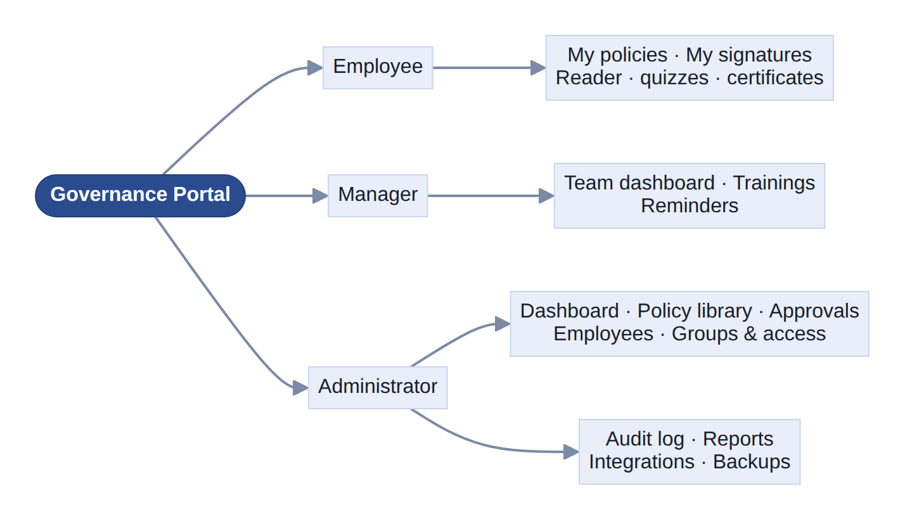

_Mermaid source: [`flows/mermaid/00-app-map.mmd`](flows/mermaid/00-app-map.mmd)_

## Authentication & RBAC gate

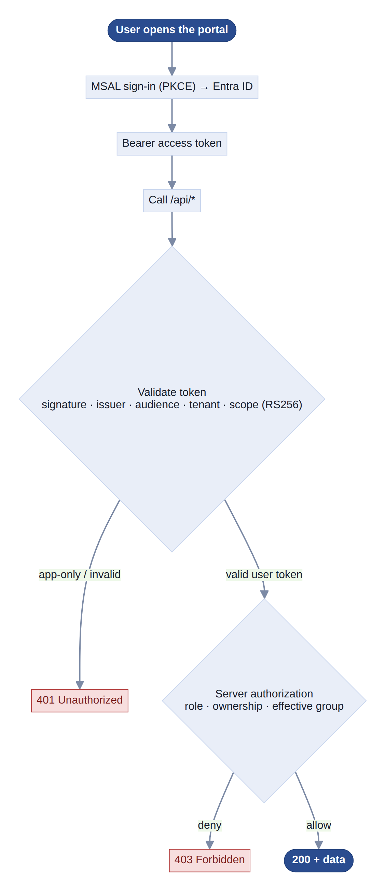

_Mermaid source: [`flows/mermaid/01-auth-rbac.mmd`](flows/mermaid/01-auth-rbac.mmd)_

## Policy lifecycle — author → version → archive

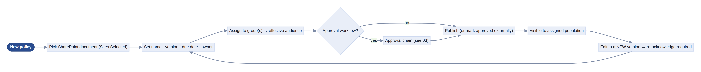

_Mermaid source: [`flows/mermaid/02-policy-lifecycle.mmd`](flows/mermaid/02-policy-lifecycle.mmd)_

## Approval workflow — submit → decide → publish

Ordered **steps**; each step is satisfied by **all**, **any**, or a **quorum** of its
approvers (people and/or directory groups, frozen to members at submit). Every
decision is written to an append-only decision ledger.

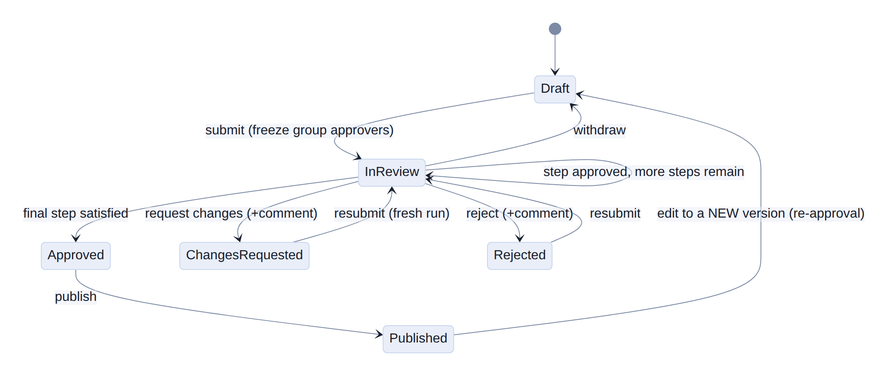

_Mermaid source: [`flows/mermaid/03-approval.mmd`](flows/mermaid/03-approval.mmd)_

## Acknowledgement + knowledge check

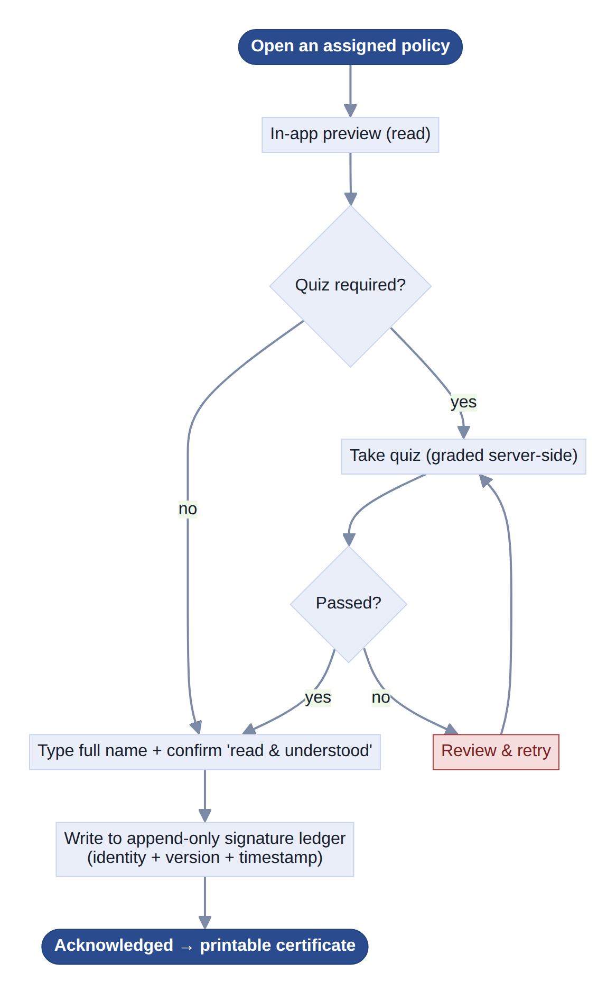

_Mermaid source: [`flows/mermaid/04-acknowledge.mmd`](flows/mermaid/04-acknowledge.mmd)_

## Targeting — groups, mapping & effective membership

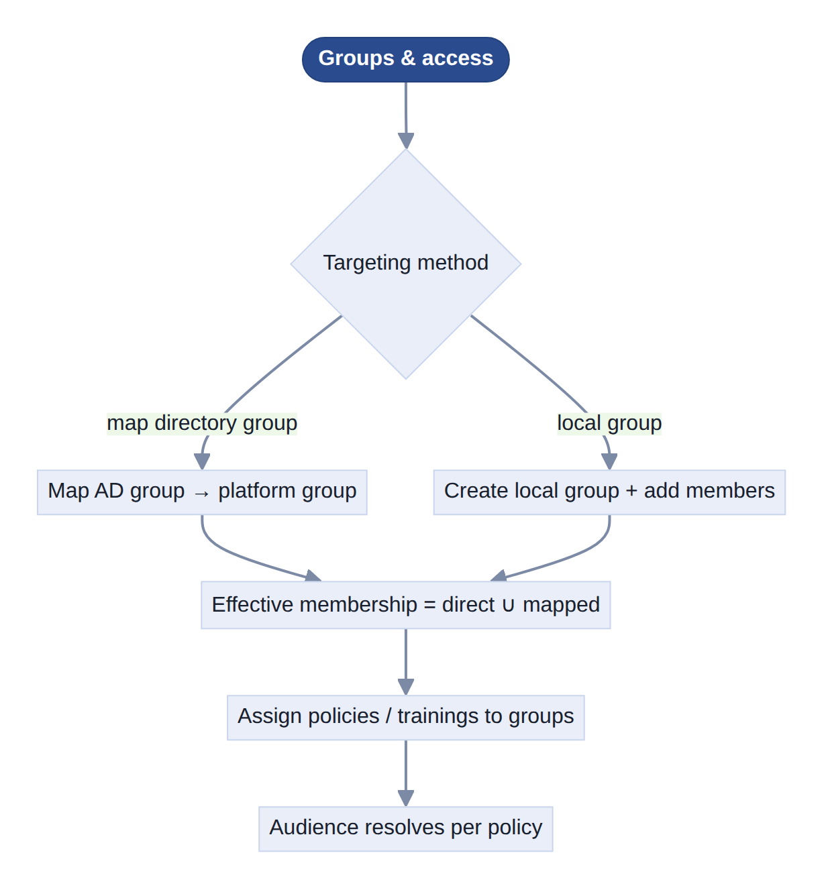

_Mermaid source: [`flows/mermaid/05-targeting.mmd`](flows/mermaid/05-targeting.mmd)_

## Directory sync — least-privilege Entra/Graph

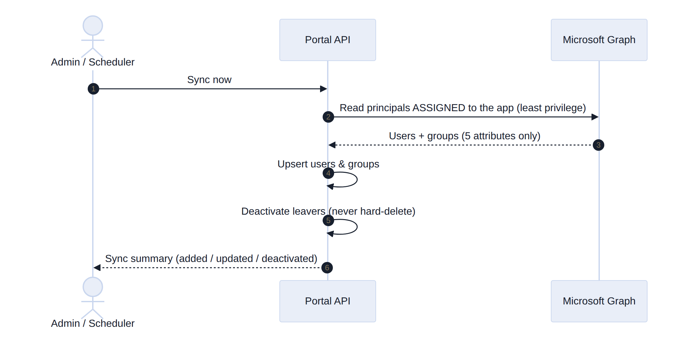

_Mermaid source: [`flows/mermaid/06-directory-sync.mmd`](flows/mermaid/06-directory-sync.mmd)_

## Document source & preview (SharePoint)

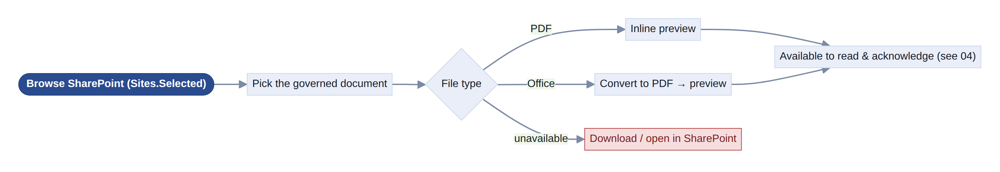

_Mermaid source: [`flows/mermaid/07-documents.mmd`](flows/mermaid/07-documents.mmd)_

## Reminder ladder — escalating notifications

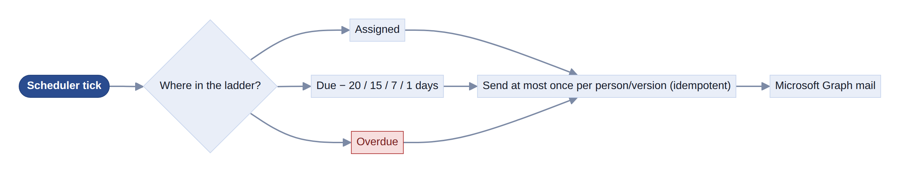

_Mermaid source: [`flows/mermaid/08-reminders.mmd`](flows/mermaid/08-reminders.mmd)_

## Reporting & dashboards roll-up

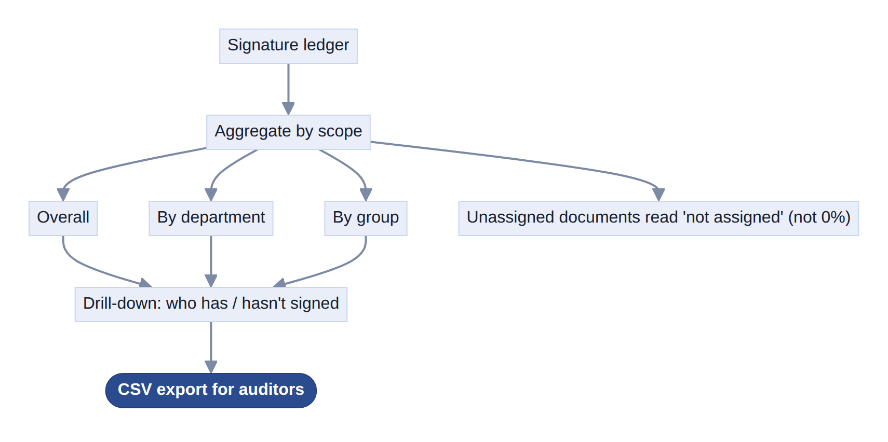

_Mermaid source: [`flows/mermaid/09-reporting.mmd`](flows/mermaid/09-reporting.mmd)_

## Immutable audit log + pull/push feed

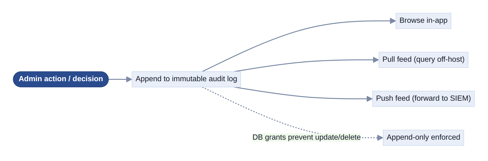

_Mermaid source: [`flows/mermaid/10-audit.mmd`](flows/mermaid/10-audit.mmd)_

## GDPR data-subject rights (DSAR / erasure / retention)

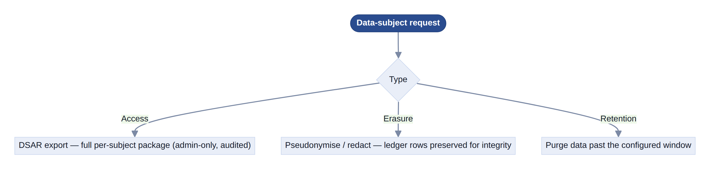

_Mermaid source: [`flows/mermaid/11-gdpr.mmd`](flows/mermaid/11-gdpr.mmd)_

## Backup & disaster recovery

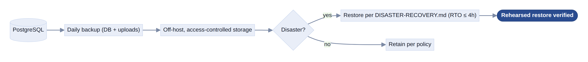

_Mermaid source: [`flows/mermaid/12-backup-dr.mmd`](flows/mermaid/12-backup-dr.mmd)_

## Leader election & scheduled jobs

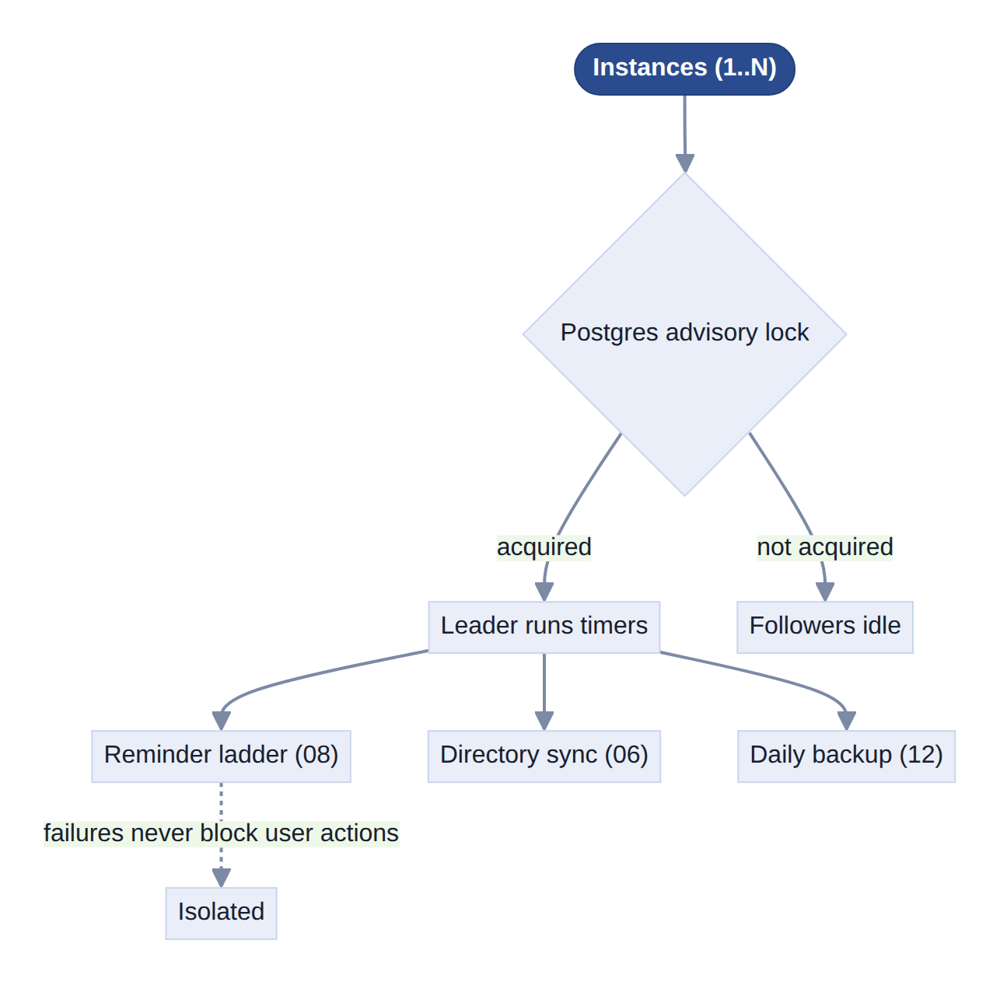

_Mermaid source: [`flows/mermaid/13-scheduler.mmd`](flows/mermaid/13-scheduler.mmd)_

## Observability — metrics, health, logs

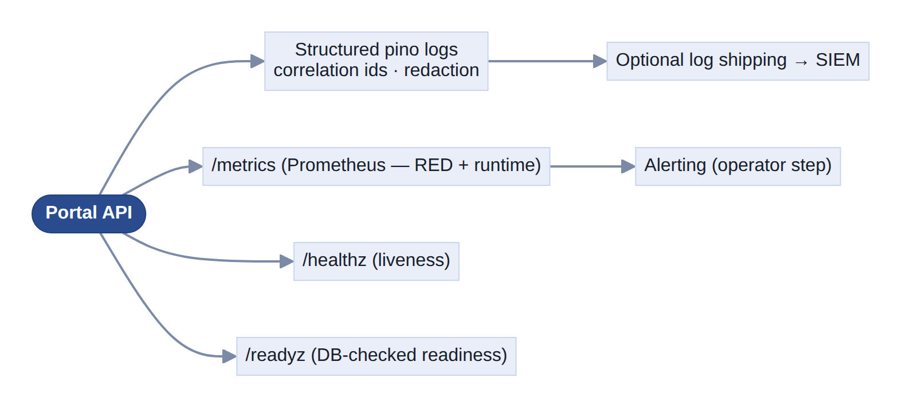

_Mermaid source: [`flows/mermaid/14-observability.mmd`](flows/mermaid/14-observability.mmd)_

---

# User journeys

## Employee — acknowledge a policy (quiz-gated)

_Mermaid source: [`flows/mermaid/user-01-employee-ack.mmd`](flows/mermaid/user-01-employee-ack.mmd)_

## Employee — outstanding & re-sign on new version

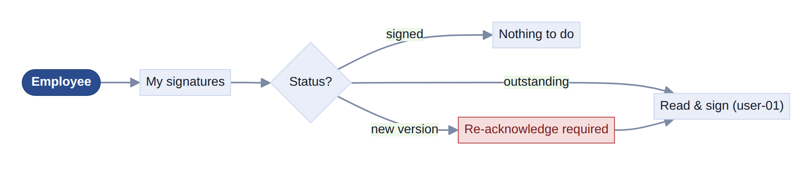

_Mermaid source: [`flows/mermaid/user-02-employee-outstanding.mmd`](flows/mermaid/user-02-employee-outstanding.mmd)_

## Manager — team compliance, trainings & nudges

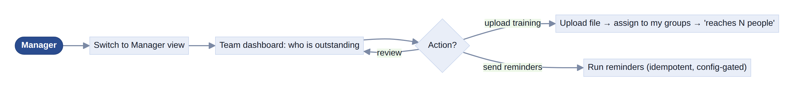

_Mermaid source: [`flows/mermaid/user-03-manager-team.mmd`](flows/mermaid/user-03-manager-team.mmd)_

Managers only ever see and act on **their own team** (functional-manager reports ∪
directory-manager matches) and their **own** trainings.

## Administrator — onboard & publish a policy

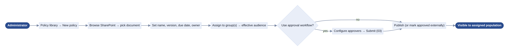

_Mermaid source: [`flows/mermaid/user-04-admin-publish.mmd`](flows/mermaid/user-04-admin-publish.mmd)_

## Approver — decide (approve / reject / request changes)

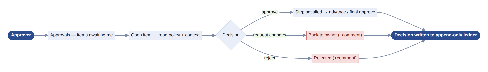

_Mermaid source: [`flows/mermaid/user-05-approver-decide.mmd`](flows/mermaid/user-05-approver-decide.mmd)_

Employees cannot see a policy while it is under review — only owner, admin and
configured approvers can (so they can act).

## Administrator — groups, directory mapping & sync

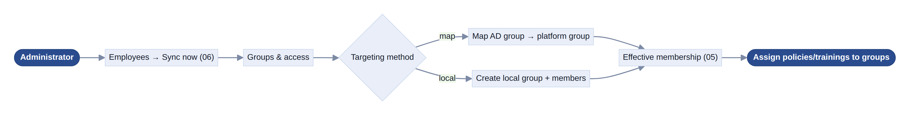

_Mermaid source: [`flows/mermaid/user-06-admin-groups.mmd`](flows/mermaid/user-06-admin-groups.mmd)_

## DPO / Auditor — data-subject rights & audit export

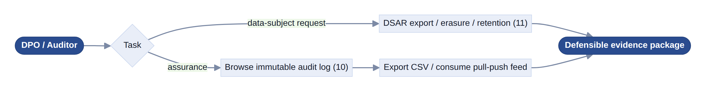

_Mermaid source: [`flows/mermaid/user-07-dpo-audit.mmd`](flows/mermaid/user-07-dpo-audit.mmd)_

---

# Software-development interaction

## Change lifecycle — branch → PR → CI → merge

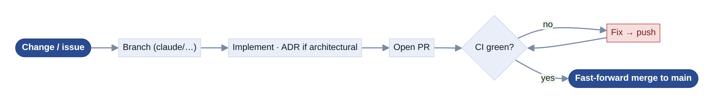

_Mermaid source: [`flows/mermaid/dev-01-change-lifecycle.mmd`](flows/mermaid/dev-01-change-lifecycle.mmd)_

## CI pipeline — the gating jobs

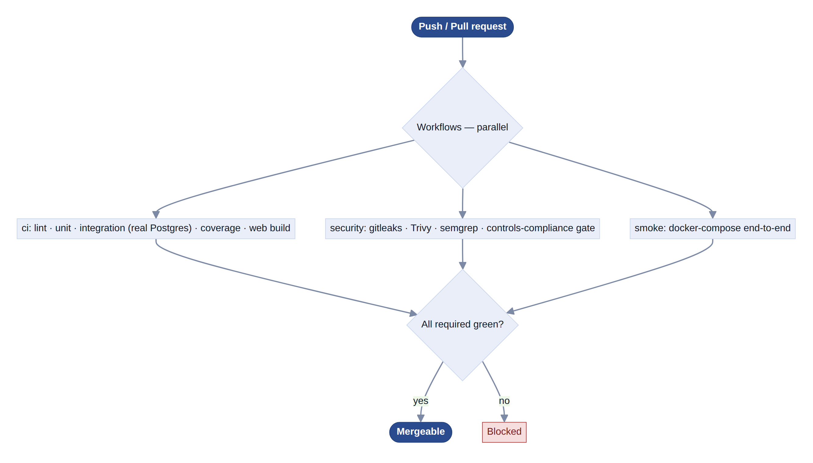

_Mermaid source: [`flows/mermaid/dev-02-ci-pipeline.mmd`](flows/mermaid/dev-02-ci-pipeline.mmd)_

## Controls-as-code compliance gate

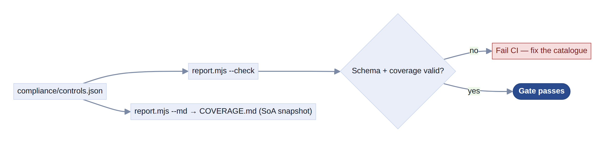

_Mermaid source: [`flows/mermaid/dev-03-controls-gate.mmd`](flows/mermaid/dev-03-controls-gate.mmd)_

## Test strategy — unit → integration → smoke

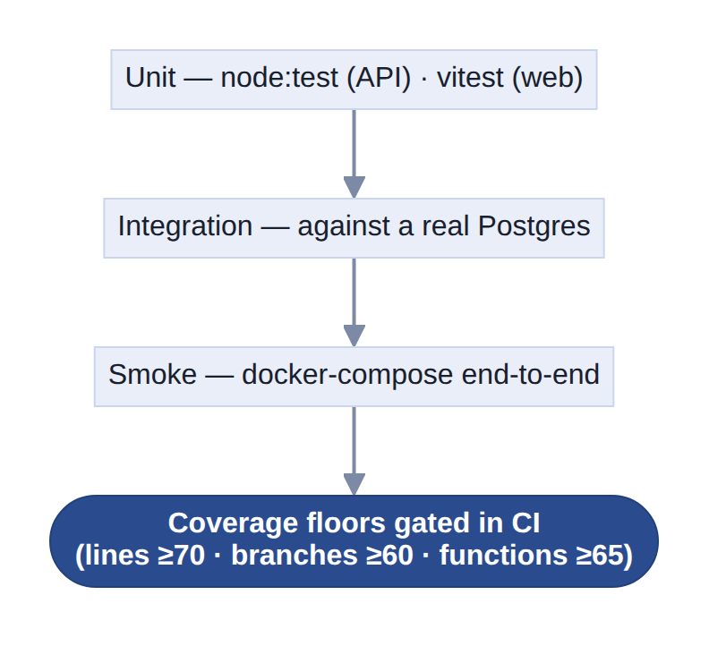

_Mermaid source: [`flows/mermaid/dev-04-test-strategy.mmd`](flows/mermaid/dev-04-test-strategy.mmd)_

## Local dev loop

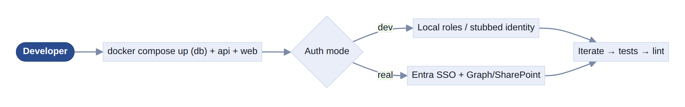

_Mermaid source: [`flows/mermaid/dev-05-local-dev.mmd`](flows/mermaid/dev-05-local-dev.mmd)_

## Build & air-gapped deploy

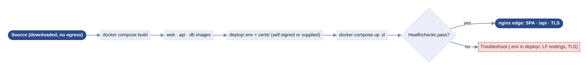

_Mermaid source: [`flows/mermaid/dev-06-build-deploy.mmd`](flows/mermaid/dev-06-build-deploy.mmd)_

## Runtime topology (component interaction)

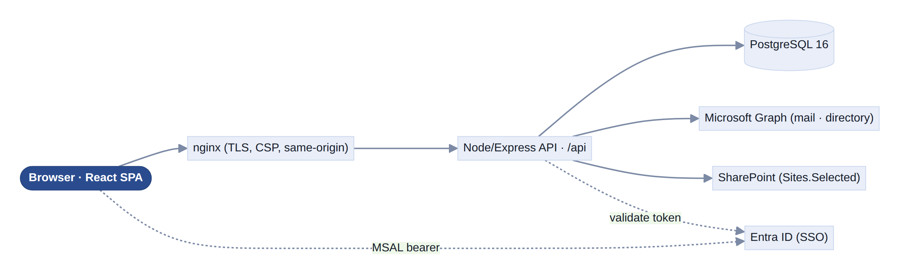

_Mermaid source: [`flows/mermaid/dev-07-runtime-topology.mmd`](flows/mermaid/dev-07-runtime-topology.mmd)_

## Database migrations & append-only grants

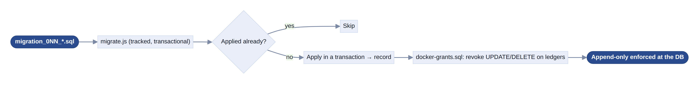

_Mermaid source: [`flows/mermaid/dev-08-migrations.mmd`](flows/mermaid/dev-08-migrations.mmd)_

## Dependency currency (Dependabot + audit/Trivy)

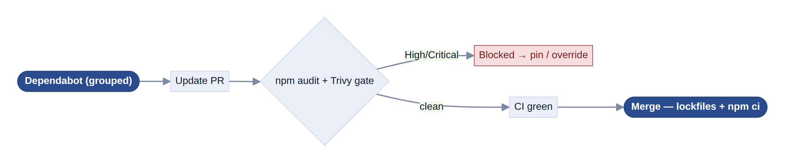

_Mermaid source: [`flows/mermaid/dev-09-dependencies.mmd`](flows/mermaid/dev-09-dependencies.mmd)_

---

## Cross-cutting experience

- **Single sign-on** — one Microsoft sign-in; the API validates every request; no
  separate password.
- **Role-view switch** — users entitled to Manager/Admin can switch views; each view
  is re-authorised server-side.
- **Document preview** — PDFs render inline; Office files convert to PDF; a
  download/open-in-SharePoint fallback appears when preview is unavailable.
- **Idle logout** — automatic sign-out after 15 minutes of inactivity.
- **Theming** — light/dark toggle, remembered per device, defaulting to the OS setting.
- **Friendly errors** — server error codes map to plain-language messages (~32-code
  catalogue) rather than raw failures.

## Golden path (end-to-end)

Admin picks a SharePoint document → assigns it to a group → routes it through approval
→ publishes → assigned employees are reminded → each reads it, passes the quiz, and
signs → the manager and admin watch compliance reach 100% → an auditor exports the CSV
and the immutable audit trail. The runtime version of this path is
[`request-sequence.mmd`](request-sequence.mmd).

## References

[`REQUIREMENTS.md`](REQUIREMENTS.md) · [`USER-STORIES.md`](USER-STORIES.md) ·
[`HLD.md`](HLD.md) · [`LLD.md`](LLD.md) · [`USER-GUIDE.md`](USER-GUIDE.md) ·
approval detail in [`approval-workflow/`](approval-workflow/README.md) ·
offline gallery [`flows-gallery.html`](flows-gallery.html) ·
diagrams [`request-sequence.mmd`](request-sequence.mmd) /
[`architecture-diagram.mmd`](architecture-diagram.mmd).
