# Governance Portal — Functional Flows

A functional, **user-perspective** view of the Birgma Governance Portal presented as
flow diagrams in three views: **system & data flows**, **user journeys**
(persona → goal), and **software-development interaction**. Each entry shows a live
Mermaid diagram; the self-contained, air-gapped gallery
([`flows-gallery.html`](flows-gallery.html)) renders every diagram as inline SVG for
offline viewing. For the technical request path see
[`request-sequence.mmd`](request-sequence.mmd); for endpoints see [`LLD.md`](LLD.md);
for requirements see [`REQUIREMENTS.md`](REQUIREMENTS.md).

---

## Personas & roles

| Persona | Sees | Primary goal |
|---|---|---|
| **Employee** | Their assigned policies, trainings, quizzes | Stay compliant — read & acknowledge |
| **Manager** | Their team's compliance + own trainings | Keep the team compliant |
| **Administrator** | Everything: authoring, groups, sync, reports, integrations | Publish & govern; run the platform |
| **Approver** | Items awaiting their decision | Sign off before publication |
| **DPO / Auditor** | Audit trail, DSAR export | Evidence & data-subject rights |
| **System / Scheduler** | — (unattended) | Reminders, sync, backups |

Roles come from Entra app roles; the SPA shows an **Employee / Manager / Admin** view
switch for users entitled to more than one. Authorization is enforced **server-side**
on every request — the client is never a security boundary.

## Feature catalogue

| Area | Feature | Who | Flow |
|---|---|---|---|
| Identity | SSO sign-in, role-view switch, 15-min idle logout | All | `01` |
| Policy lifecycle | Create/edit/version/archive; SharePoint document source | Admin | `02`, `07` |
| Approval workflow | Ordered steps (all/any/quorum), group approvers, templates | Admin/Approver | `03`, `user-05` |
| Acknowledgement | Binding, append-only signature + certificate | Employee | `04`, `user-01` |
| Knowledge check | Server-graded quiz, quiz-gated signing | Employee | `04` |
| Targeting | Groups, directory-group mapping, effective membership | Admin | `05` |
| Directory sync | Least-privilege Entra/Graph import (assigned only) | Admin/System | `06` |
| Manager trainings | Upload & assign training material; nudges | Manager | `user-03` |
| Reporting | Dashboards (overall/dept/group), drill-down, CSV export | Admin/Manager | `09` |
| Notifications | Escalating reminder ladder; manual nudges | System/Manager | `08` |
| Audit | Immutable audit log; pull/push feed | Admin/Auditor | `10` |
| Data protection | DSAR export, evidence-preserving erasure, retention | Admin/DPO | `11`, `user-07` |
| Operations | Backups, disaster recovery, scheduled jobs | Admin/System | `12`, `13` |
| Observability | Metrics, health, structured logs | Admin/System | `14` |

---

# Flow index

## System & data flows
- [Application map & navigation](#00-app-map)
- [Authentication & RBAC gate](#01-auth-rbac)
- [Policy lifecycle — author → version → archive](#02-policy-lifecycle)
- [Approval workflow — submit → decide → publish](#03-approval)
- [Acknowledgement + knowledge check](#04-acknowledge)
- [Targeting — groups, mapping & effective membership](#05-targeting)
- [Directory sync — least-privilege Entra/Graph](#06-directory-sync)
- [Document source & preview (SharePoint)](#07-documents)
- [Reminder ladder — escalating notifications](#08-reminders)
- [Reporting & dashboards roll-up](#09-reporting)
- [Immutable audit log + pull/push feed](#10-audit)
- [GDPR data-subject rights (DSAR / erasure / retention)](#11-gdpr)
- [Backup & disaster recovery](#12-backup-dr)
- [Leader election & scheduled jobs](#13-scheduler)
- [Observability — metrics, health, logs](#14-observability)

## User journeys
- [Employee — acknowledge a policy (quiz-gated)](#user-01-employee-ack)
- [Employee — outstanding & re-sign on new version](#user-02-employee-outstanding)
- [Manager — team compliance, trainings & nudges](#user-03-manager-team)
- [Administrator — onboard & publish a policy](#user-04-admin-publish)
- [Approver — decide (approve / reject / request changes)](#user-05-approver-decide)
- [Administrator — groups, directory mapping & sync](#user-06-admin-groups)
- [DPO / Auditor — data-subject rights & audit export](#user-07-dpo-audit)

## Software-development interaction
- [Change lifecycle — branch → PR → CI → merge](#dev-01-change-lifecycle)
- [CI pipeline — the gating jobs](#dev-02-ci-pipeline)
- [Controls-as-code compliance gate](#dev-03-controls-gate)
- [Test strategy — unit → integration → smoke](#dev-04-test-strategy)
- [Local dev loop](#dev-05-local-dev)
- [Build & air-gapped deploy](#dev-06-build-deploy)
- [Runtime topology (component interaction)](#dev-07-runtime-topology)
- [Database migrations & append-only grants](#dev-08-migrations)
- [Dependency currency (Dependabot + audit/Trivy)](#dev-09-dependencies)

---

# System & data flows


<a id="00-app-map"></a>

## Application map & navigation

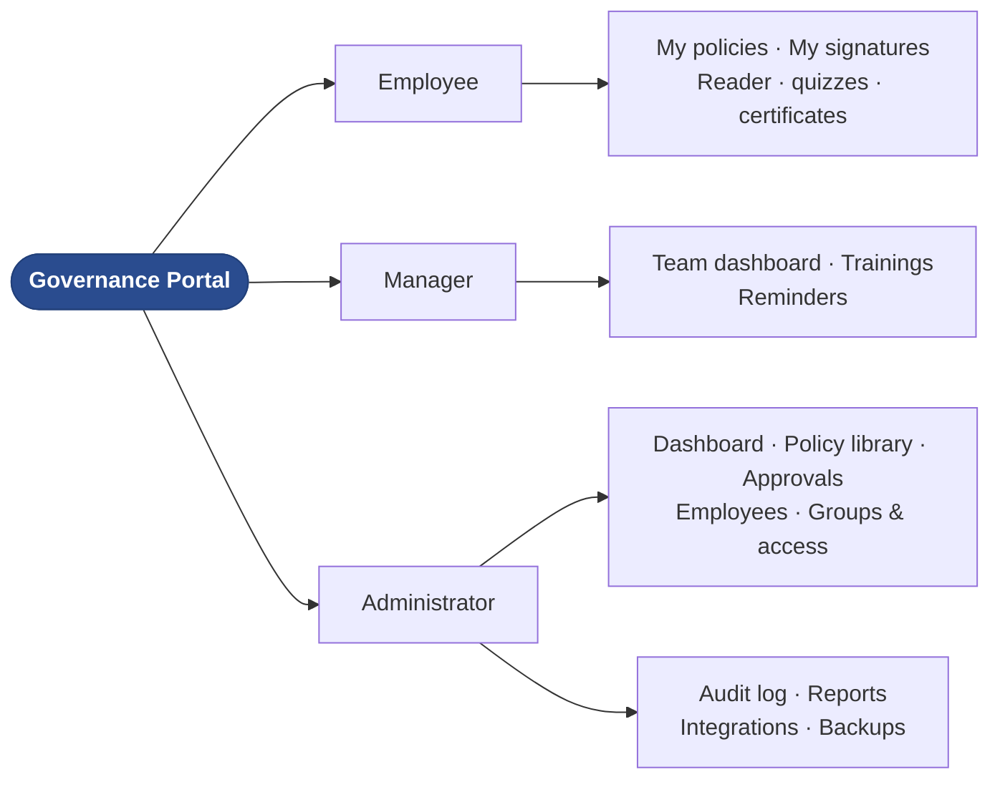


<a id="01-auth-rbac"></a>

## Authentication & RBAC gate

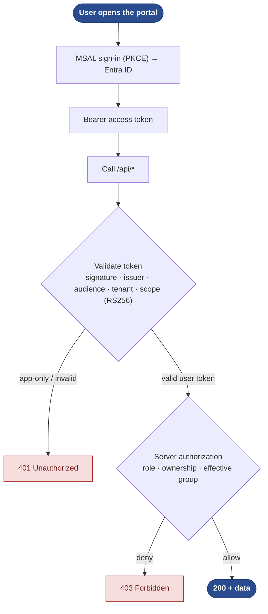


<a id="02-policy-lifecycle"></a>

## Policy lifecycle — author → version → archive

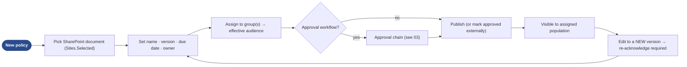


<a id="03-approval"></a>

## Approval workflow — submit → decide → publish

Ordered **steps**; each step is satisfied by **all**, **any**, or a **quorum** of its
approvers (people and/or directory groups, frozen to members at submit). Every
decision is written to an append-only decision ledger.

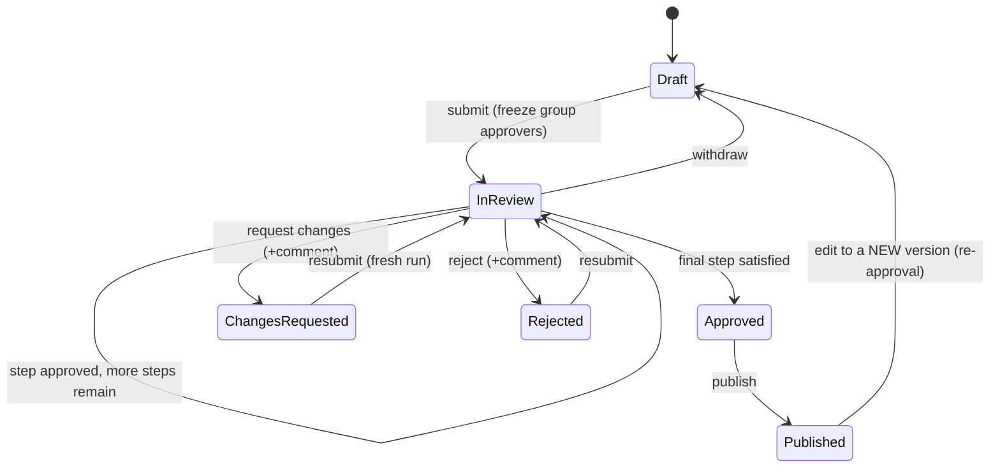


<a id="04-acknowledge"></a>

## Acknowledgement + knowledge check

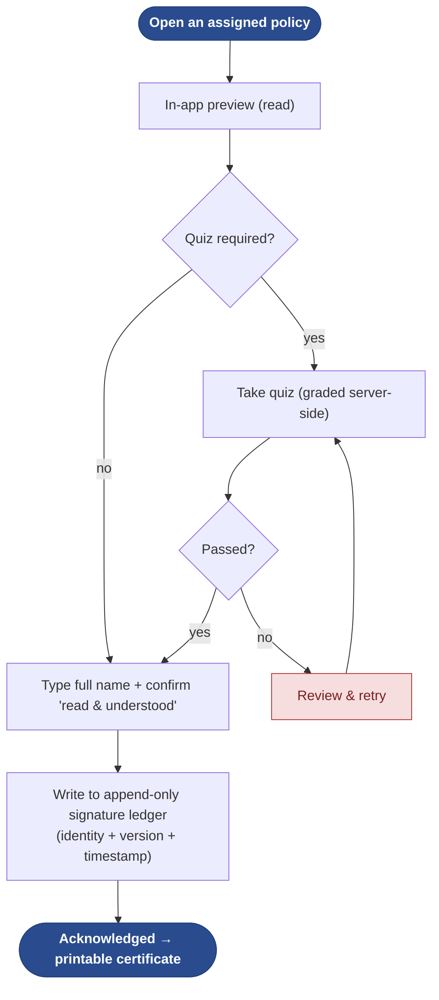


<a id="05-targeting"></a>

## Targeting — groups, mapping & effective membership

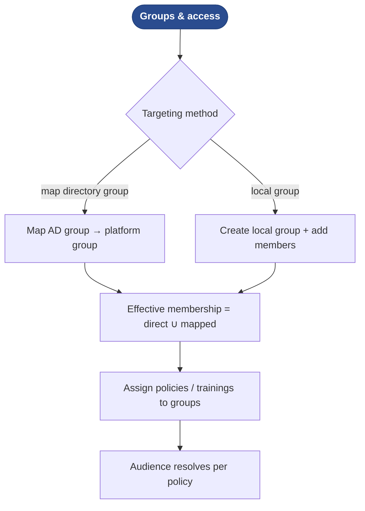


<a id="06-directory-sync"></a>

## Directory sync — least-privilege Entra/Graph

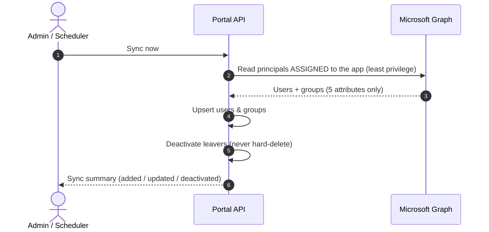


<a id="07-documents"></a>

## Document source & preview (SharePoint)

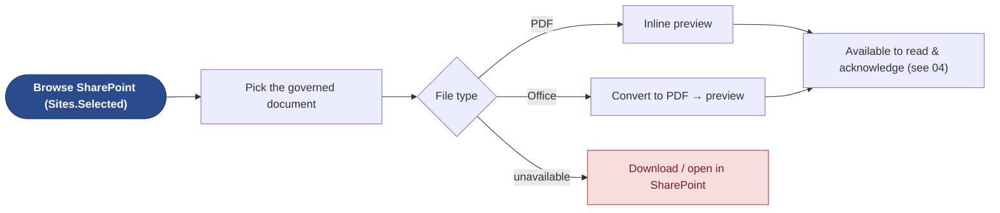


<a id="08-reminders"></a>

## Reminder ladder — escalating notifications

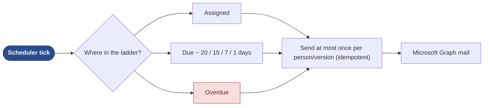


<a id="09-reporting"></a>

## Reporting & dashboards roll-up

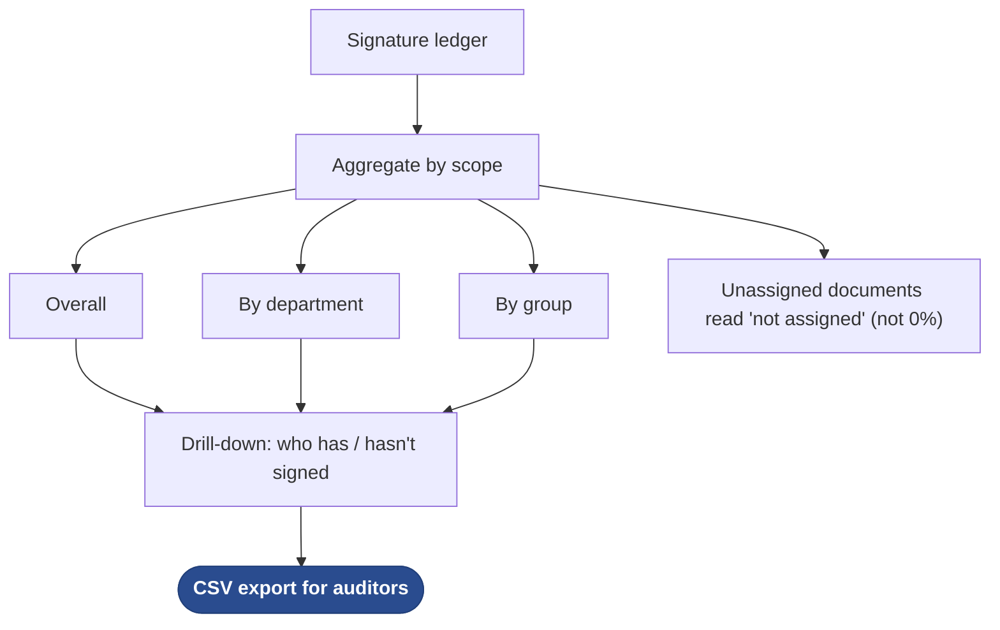


<a id="10-audit"></a>

## Immutable audit log + pull/push feed

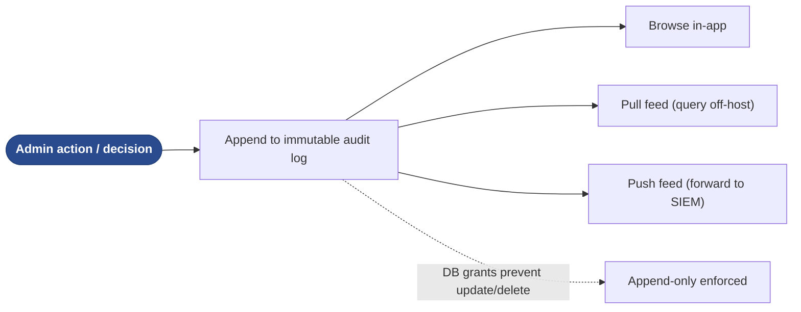


<a id="11-gdpr"></a>

## GDPR data-subject rights (DSAR / erasure / retention)

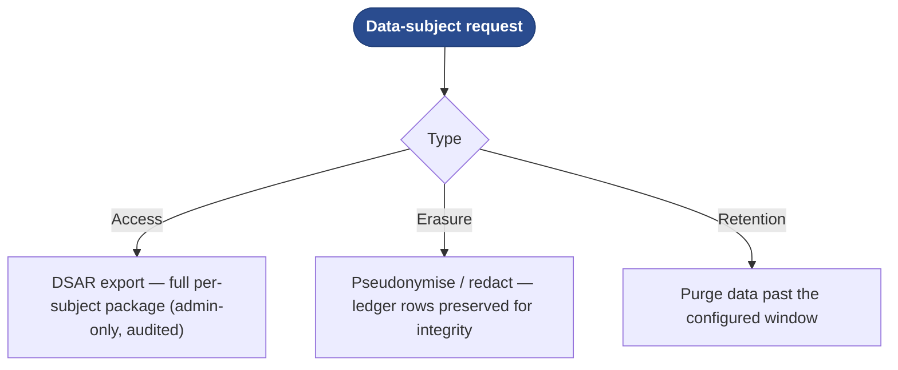


<a id="12-backup-dr"></a>

## Backup & disaster recovery

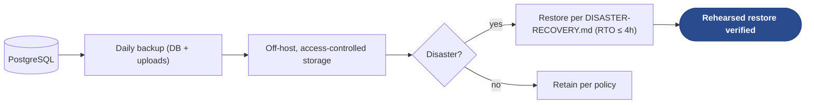


<a id="13-scheduler"></a>

## Leader election & scheduled jobs

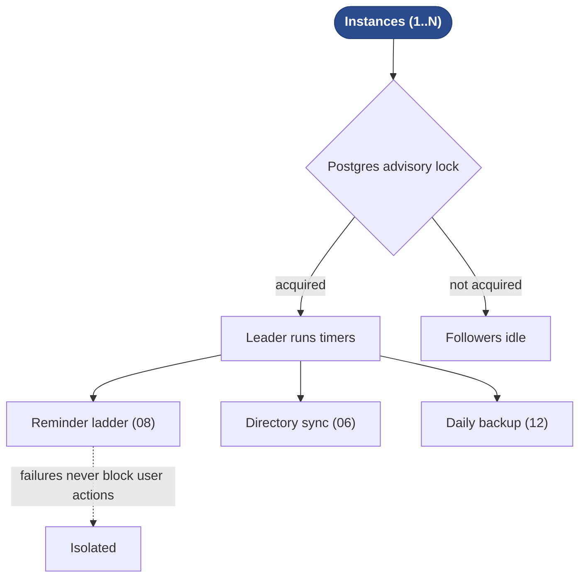


<a id="14-observability"></a>

## Observability — metrics, health, logs

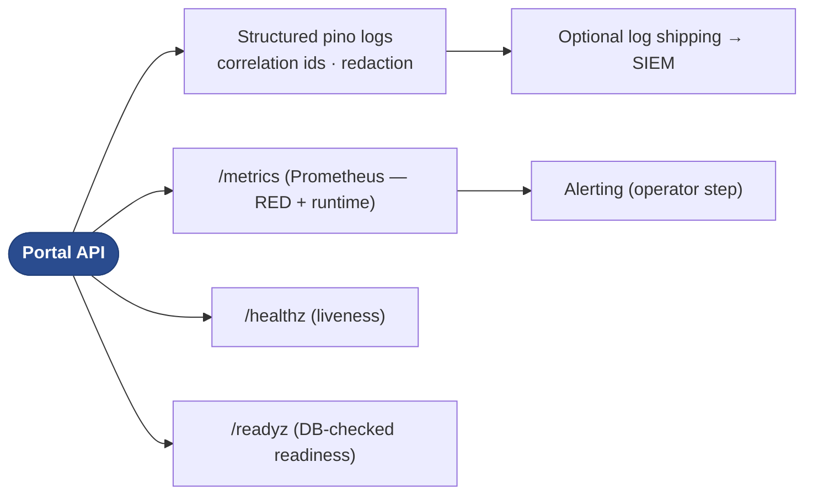


---

# User journeys


<a id="user-01-employee-ack"></a>

## Employee — acknowledge a policy (quiz-gated)


<a id="user-02-employee-outstanding"></a>

## Employee — outstanding & re-sign on new version

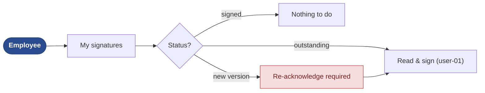


<a id="user-03-manager-team"></a>

## Manager — team compliance, trainings & nudges

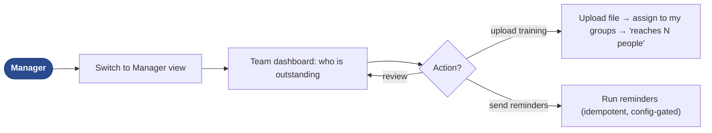

Managers only ever see and act on **their own team** (functional-manager reports ∪
directory-manager matches) and their **own** trainings.


<a id="user-04-admin-publish"></a>

## Administrator — onboard & publish a policy

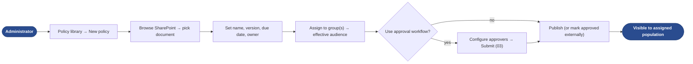


<a id="user-05-approver-decide"></a>

## Approver — decide (approve / reject / request changes)

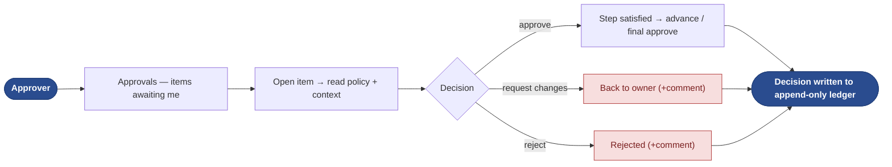

Employees cannot see a policy while it is under review — only owner, admin and
configured approvers can (so they can act).


<a id="user-06-admin-groups"></a>

## Administrator — groups, directory mapping & sync

```mermaid
graph LR
  U(["Administrator"]):::start --> A["Employees → Sync now (06)"]
  A --> B["Groups & access"]
  B --> C{"Targeting method"}
  C -- map --> D["Map AD group → platform group"]
  C -- local --> E["Create local group + members"]
  D --> F["Effective membership (05)"]
  E --> F
  F --> G(["Assign policies/trainings to groups"]):::start
  classDef start fill:#2a4c8f,stroke:#22407a,color:#ffffff,font-weight:600;
```


<a id="user-07-dpo-audit"></a>

## DPO / Auditor — data-subject rights & audit export

```mermaid
graph LR
  U(["DPO / Auditor"]):::start --> A{"Task"}
  A -- data-subject request --> B["DSAR export / erasure / retention (11)"]
  A -- assurance --> C["Browse immutable audit log (10)"]
  C --> D["Export CSV / consume pull-push feed"]
  B --> E(["Defensible evidence package"]):::start
  D --> E
  classDef start fill:#2a4c8f,stroke:#22407a,color:#ffffff,font-weight:600;
```


---

# Software-development interaction


<a id="dev-01-change-lifecycle"></a>

## Change lifecycle — branch → PR → CI → merge

```mermaid
graph LR
  I(["Change / issue"]):::start --> B["Branch (claude/…)"]
  B --> IMP["Implement · ADR if architectural"]
  IMP --> PR["Open PR"]
  PR --> CI{"CI green?"}
  CI -- no --> FIX["Fix → push"]:::deny
  FIX --> CI
  CI -- yes --> M(["Fast-forward merge to main"]):::start
  classDef start fill:#2a4c8f,stroke:#22407a,color:#ffffff,font-weight:600;
  classDef deny fill:#f7dede,stroke:#b23a3a,color:#7a1f1f;
```


<a id="dev-02-ci-pipeline"></a>

## CI pipeline — the gating jobs

```mermaid
graph TD
  P(["Push / Pull request"]):::start --> J{"Workflows — parallel"}
  J --> CI["ci: lint · unit · integration (real Postgres) · coverage · web build"]
  J --> SEC["security: gitleaks · Trivy · semgrep · controls-compliance gate"]
  J --> SMK["smoke: docker-compose end-to-end"]
  CI --> G{"All required green?"}
  SEC --> G
  SMK --> G
  G -- yes --> OK(["Mergeable"]):::start
  G -- no --> BL["Blocked"]:::deny
  classDef start fill:#2a4c8f,stroke:#22407a,color:#ffffff,font-weight:600;
  classDef deny fill:#f7dede,stroke:#b23a3a,color:#7a1f1f;
```


<a id="dev-03-controls-gate"></a>

## Controls-as-code compliance gate

```mermaid
graph LR
  CJ["compliance/controls.json"] --> RPT["report.mjs --check"]
  RPT --> V{"Schema + coverage valid?"}
  V -- no --> FAIL["Fail CI — fix the catalogue"]:::deny
  V -- yes --> OK(["Gate passes"]):::start
  CJ --> MD["report.mjs --md → COVERAGE.md (SoA snapshot)"]
  classDef start fill:#2a4c8f,stroke:#22407a,color:#ffffff,font-weight:600;
  classDef deny fill:#f7dede,stroke:#b23a3a,color:#7a1f1f;
```


<a id="dev-04-test-strategy"></a>

## Test strategy — unit → integration → smoke

```mermaid
graph TD
  U["Unit — node:test (API) · vitest (web)"] --> I["Integration — against a real Postgres"]
  I --> E["Smoke — docker-compose end-to-end"]
  E --> COV(["Coverage floors gated in CI<br/>(lines ≥70 · branches ≥60 · functions ≥65)"]):::start
  classDef start fill:#2a4c8f,stroke:#22407a,color:#ffffff,font-weight:600;
```


<a id="dev-05-local-dev"></a>

## Local dev loop

```mermaid
graph LR
  D(["Developer"]):::start --> A["docker compose up (db) + api + web"]
  A --> B{"Auth mode"}
  B -- dev --> C["Local roles / stubbed identity"]
  B -- real --> E["Entra SSO + Graph/SharePoint"]
  C --> F["Iterate → tests → lint"]
  E --> F
  classDef start fill:#2a4c8f,stroke:#22407a,color:#ffffff,font-weight:600;
```


<a id="dev-06-build-deploy"></a>

## Build & air-gapped deploy

```mermaid
graph LR
  SRC(["Source (downloaded, no egress)"]):::start --> BUILD["docker compose build"]
  BUILD --> IMG["web · api · db images"]
  IMG --> ENV["deploy/.env + certs/ (self-signed or supplied)"]
  ENV --> UP["docker compose up -d"]
  UP --> HC{"Healthchecks pass?"}
  HC -- yes --> LIVE(["nginx edge: SPA · /api · TLS"]):::start
  HC -- no --> DIAG["Troubleshoot (.env in deploy/, LF endings, TLS)"]:::deny
  classDef start fill:#2a4c8f,stroke:#22407a,color:#ffffff,font-weight:600;
  classDef deny fill:#f7dede,stroke:#b23a3a,color:#7a1f1f;
```


<a id="dev-07-runtime-topology"></a>

## Runtime topology (component interaction)

```mermaid
graph LR
  BR(["Browser · React SPA"]):::start --> NG["nginx (TLS, CSP, same-origin)"]
  NG --> API["Node/Express API · /api"]
  API --> DB[("PostgreSQL 16")]
  API --> GR["Microsoft Graph (mail · directory)"]
  API --> SP["SharePoint (Sites.Selected)"]
  BR -. "MSAL bearer" .-> ENTRA["Entra ID (SSO)"]
  API -. "validate token" .-> ENTRA
  classDef start fill:#2a4c8f,stroke:#22407a,color:#ffffff,font-weight:600;
```


<a id="dev-08-migrations"></a>

## Database migrations & append-only grants

```mermaid
graph LR
  M(["migration_0NN_*.sql"]):::start --> RUN["migrate.js (tracked, transactional)"]
  RUN --> APPLY{"Applied already?"}
  APPLY -- yes --> SKIP["Skip"]
  APPLY -- no --> TX["Apply in a transaction → record"]
  TX --> GRANT["docker-grants.sql: revoke UPDATE/DELETE on ledgers"]
  GRANT --> AO(["Append-only enforced at the DB"]):::start
  classDef start fill:#2a4c8f,stroke:#22407a,color:#ffffff,font-weight:600;
```


<a id="dev-09-dependencies"></a>

## Dependency currency (Dependabot + audit/Trivy)

```mermaid
graph LR
  DB2(["Dependabot (grouped)"]):::start --> PR["Update PR"]
  PR --> AUD{"npm audit + Trivy gate"}
  AUD -- High/Critical --> BLOCK["Blocked → pin / override"]:::deny
  AUD -- clean --> CI["CI green"]
  CI --> MG(["Merge — lockfiles + npm ci"]):::start
  classDef start fill:#2a4c8f,stroke:#22407a,color:#ffffff,font-weight:600;
  classDef deny fill:#f7dede,stroke:#b23a3a,color:#7a1f1f;
```


---

## Cross-cutting experience

- **Single sign-on** — one Microsoft sign-in; the API validates every request; no
  separate password.
- **Role-view switch** — users entitled to Manager/Admin can switch views; each view
  is re-authorised server-side.
- **Document preview** — PDFs render inline; Office files convert to PDF; a
  download/open-in-SharePoint fallback appears when preview is unavailable.
- **Idle logout** — automatic sign-out after 15 minutes of inactivity.
- **Theming** — light/dark toggle, remembered per device, defaulting to the OS setting.
- **Friendly errors** — server error codes map to plain-language messages (~32-code
  catalogue) rather than raw failures.

## Golden path (end-to-end)

Admin picks a SharePoint document → assigns it to a group → routes it through approval
→ publishes → assigned employees are reminded → each reads it, passes the quiz, and
signs → the manager and admin watch compliance reach 100% → an auditor exports the CSV
and the immutable audit trail. The runtime version of this path is
[`request-sequence.mmd`](request-sequence.mmd).

## References

[`REQUIREMENTS.md`](REQUIREMENTS.md) · [`USER-STORIES.md`](USER-STORIES.md) ·
[`HLD.md`](HLD.md) · [`LLD.md`](LLD.md) · [`USER-GUIDE.md`](USER-GUIDE.md) ·
approval detail in [`approval-workflow/`](approval-workflow/README.md) ·
offline gallery [`flows-gallery.html`](flows-gallery.html) ·
diagrams [`request-sequence.mmd`](request-sequence.mmd) /
[`architecture-diagram.mmd`](architecture-diagram.mmd).
