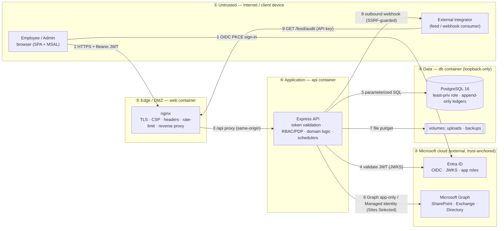

# Threat Model — Birgma Governance Portal

_Application-wide threat model using **STRIDE** (per element / data flow) and
**MITRE ATT&CK** (Enterprise) technique mapping, with a **LINDDUN** privacy pass
(the system holds HR/compliance PII). Every mitigation is traced to a control in
[`../compliance/controls.json`](../compliance/controls.json) (by control ID) and to
the enforcing code (`file:line`). This consolidates and extends the STRIDE/ATT&CK
tables in [`SECURITY-REVIEW.md`](SECURITY-REVIEW.md) §2–3 and the feature-scoped
[`approval-workflow/SECURITY-ASSESSMENT.md`](approval-workflow/SECURITY-ASSESSMENT.md)._

> Realizes control **GOV-03**. Numbers (control/technique counts) are authoritative
> in the catalogue — run `node compliance/report.mjs` for live figures.

---

## 1. Scope, method & risk scale

- **In scope:** the deployed 3-container stack (nginx `web` · Node/Express `api` ·
  PostgreSQL `db`), its data flows to Microsoft Entra ID and Microsoft Graph /
  SharePoint / Exchange, the pull/push audit feed, and the data at rest (DB volume,
  uploads, backups). See [`deployment-diagram.mmd`](deployment-diagram.mmd) and
  [`architecture-diagram.mmd`](architecture-diagram.mmd).
- **Out of scope (inherited / organizational):** Entra ID internals, Microsoft
  Graph, the Windows/VMware host and Docker daemon hardening, physical security,
  and the corporate network — these are trust-anchored to Microsoft and IT ops and
  are called out as **organizational** controls where relevant.
- **Method:** STRIDE per data flow + element; each threat mapped to MITRE ATT&CK
  technique(s), to an existing mitigating control, and to a residual-risk note.
- **Risk = Likelihood × Impact** (Low / Medium / High). "Residual" is the risk
  *after* the listed mitigation.

### Threat actors
| Actor | Motivation | Assumed capability |
|---|---|---|
| External unauthenticated attacker | Disruption, data theft, ransomware | Internet access to the edge only |
| Authenticated employee (curious/malicious) | See others' data, avoid obligations | Valid delegated token, employee role |
| Malicious/negligent admin or manager | Abuse scope, tamper with evidence | Elevated app role |
| Compromised integrator / webhook consumer | Pivot via the feed | A feed API key or a webhook endpoint |
| Privileged insider (VM/DB/Docker admin) | Tamper, exfiltrate | Host- or DB-superuser access |
| Supply-chain adversary | Implant via a dependency | A published malicious package version |

---

## 2. System model & trust boundaries (DFD)

**Trust boundaries crossed:** ①→③ (public TLS), ③→④ (edge→app, same-origin proxy),
④→⑤ (app→data, loopback), ④→② (app→Microsoft cloud), ④→① (outbound webhook), ①→③
(integrator pull). Each numbered flow is referenced in the threat register below.

### Assets & security objectives
| Asset | Objective | Why it matters |
|---|---|---|
| Acknowledgement / audit / quiz / approval **ledgers** | **Integrity + non-repudiation** | The compliance evidence — the product's reason to exist |
| Employee **PII** (names, email, dept, manager, sign IP/UA) | Confidentiality + privacy (GDPR) | Regulated personal data |
| Governance **documents** (SharePoint) | Confidentiality + availability | Not-yet-published / restricted policies |
| **Secrets** (DB creds, client secret, feed key, TLS key) | Confidentiality | Compromise → full impersonation |
| **Availability** of the portal | Availability (RTO ≤ 4h) | Lower priority than durability (see DR runbook) |

---

## 3. STRIDE threat register

Mitigation cites the **control ID** (in `controls.json`) and the **enforcing code**.
"Res." = residual risk after mitigation.

### Spoofing — *authenticity of principals*
| # | Threat (flow) | ATT&CK | Mitigation (control · code) | Res. |
|---|---|---|---|---|
| S1 | Forged/stolen access token impersonates a user (2,4) | T1078, T1550.001 | **IAM-01** RS256 + iss/aud/**tid**/scope, delegated-only, JWKS-cached — `auth.js:62-70`, `:32-43` | **Med** — token theft via device/XSS; shrink with MFA (**IAM-06**, org) + strict CSP |
| S2 | Credential brute-force / password spray at the IdP | T1110, T1621 | **IAM-06** MFA / Conditional Access + Entra smart-lockout (**organizational**) | **Med→High if MFA off** — top recommendation |
| S3 | Guessing/replaying the **feed** API key (9) | T1078, T1552 | Constant-time compare + own rate-limit + rotation — `app.js:110-130` (**LOG-**) | **Low** |
| S4 | Rogue process on host spoofs the app→DB client (5) | T1078 | Loopback-only `127.0.0.1:5432` + least-priv role — `docker-compose.yml:54-56` (**NET-01**, **DAT-**) | **Low** |

### Tampering — *integrity of data & code*
| # | Threat (flow) | ATT&CK | Mitigation (control · code) | Res. |
|---|---|---|---|---|
| T1 | Alter compliance evidence (signatures/audit/quiz/approvals) | T1565.001, T1070 | **DAT-01** `REVOKE update, delete` from app role — `docker-grants.sql:23-26` | **Low** — only a DB superuser could; mitigate w/ off-host backups + restricted DB admin |
| T2 | SQL injection to modify/read data (5) | T1190 | Parameterized queries throughout (`pg`); UUID param validation — `routes/index.js` | **Low** |
| T3 | Client tampers quiz answers / sign payload (2) | — | **Server-side** grading; identity taken from the **token, never the client** — `routes/quizzes.js`, `routes/signatures.js` | **Low** |
| T4 | MITM tamper in transit | T1557 | TLS 1.2/1.3 + HSTS — `nginx.conf:22-38` (**NET-02**) | **Low** — internal Docker hops are plaintext; enable `PGSSL` for prod |
| T5 | Malicious dependency version (build-time) | T1195.002 | `npm audit --audit-level=high` + **trivy** + **semgrep**/**gitleaks** CI gates; lockfiles; overrides — `.github/workflows/*` (**SUP-01/02**) | **Med** |

### Repudiation — *accountability*
| # | Threat | ATT&CK | Mitigation (control · code) | Res. |
|---|---|---|---|---|
| R1 | User denies acknowledging a policy | — | Signatures bind **oid + typed name + version + timestamp + IP**, append-only — `docker-grants.sql`, `routes/signatures.js` (**DAT-01**, **LOG-**) | **Low** |
| R2 | Admin denies a config/permission change | — | `audit()` writes an immutable `audit_log` row on every admin mutation — `authz.js:17-42` (**LOG-01**) | **Low** — forward to SIEM (org) |
| R3 | Attacker deletes logs to hide activity | T1070 | `audit_log` append-only + pull/push feed off-host — `docker-grants.sql:23-26`, `app.js` `/feed/audit` | **Low** |

### Information disclosure — *confidentiality*
| # | Threat (flow) | ATT&CK | Mitigation (control · code) | Res. |
|---|---|---|---|---|
| I1 | Broken access control → read others' policies/PII (3,5) | T1530 | **3-layer authZ**: role ∪ ownership ∪ effective-membership + **publish gate**, default-deny, re-checked per request — `authz.js:69-90` | **Med** — highest-value logic; covered by integration tests |
| I2 | Secret leakage via logs / backups / `.env` | T1552 | Log redaction (`logger.js:13-24`); DB pw via env not argv (`util.js:38-48`); `.env` gitignored; Managed-Identity target (`graph.js:16-24`) | **Med** — secrets on disk in the VM model → **Key Vault** target |
| I3 | **SSRF** via admin forward URL → cloud metadata / internal svc (8) | T1190, T1552.005 | **APP-07** `isSafeHttpUrl` blocks loopback/`169.254`/link-local/IPv6-ULA, re-checked at send — `util.js:21-33`, `logger.js:28-35`; admin-gated | **Med** — lexical only (DNS-rebind residual); RFC-1918 allowed by design |
| I4 | Over-broad SharePoint/Graph read → doc exfil (6) | T1213, T1530 | **Sites.Selected** (one site) + assigned-principals-only sync + `.default` scope — `graph.js` | **Low** |
| I5 | XSS steals token / DOM data (2) | T1059.007 | React auto-escaping; **strict CSP** `script-src 'self'` no-inline; HTML-escape in receipts/emails — `nginx.conf:38`, `app.js:44-53` | **Low** |
| I6 | Sensitive data **at rest** unencrypted (volume, backups) | T1530 | BitLocker (org) + `PGSSL`/at-rest **planned**; backups access-controlled off-host | **Med** — real gap; see recommendations |

### Denial of service — *availability*
| # | Threat (flow) | ATT&CK | Mitigation (control · code) | Res. |
|---|---|---|---|---|
| D1 | Request flooding / auth brute-force (2) | T1499 | Per-route rate limits (`/api` 120/min, `/api/sync` 15/5min, `/feed` 60/min) — `app.js:67-76`; nginx | **Med** — no edge WAF/DDoS on the VM → **Front Door/WAF** target |
| D2 | Resource exhaustion (big upload, costly sync, runaway query) | T1499 | 256 KB JSON cap + upload cap; container **mem/cpu/pids** limits; sync limiter — `docker-compose.yml:19-22`, `app.js` (**OPS-**) | **Low–Med** |
| D3 | Data-destruction / ransomware (5,7) | T1485, T1486 | Least-priv role (no `DROP`/DDL) + daily backups + **tested DR** + off-host copies — `docker-grants.sql`, `DISASTER-RECOVERY.md` (**OPS-**, **IR-01**) | **Med** — ransomware on host → off-host immutable backups essential |

### Elevation of privilege — *authorization*
| # | Threat | ATT&CK | Mitigation (control · code) | Res. |
|---|---|---|---|---|
| E1 | Non-admin hits an admin endpoint | T1078, T1068 | `requireAdmin` role gate re-evaluated per request; default deny — `auth.js:82-95` (**IAM-**) | **Low** |
| E2 | Manager acts outside their team/ownership | T1078 | `canManage` + `teamOids` scoping — `authz.js:47-64` | **Low** |
| E3 | App-role compromise → DB privilege escalation | T1068 | `governance_app` is non-owner, no DDL, no ledger mutation — `docker-grants.sql:10-26` (**DAT-**) | **Low** |
| E4 | Container escape / host compromise (Docker ≈ root) | T1611 | Non-root containers + resource limits; restrict host/Docker access (**organizational**) — `apps/*/Dockerfile` (**OPS-**) | **Med** — host hardening is org-owned |
| E5 | RCE via webshell / vulnerable dependency | T1505.003, T1059 | No `eval`; strict CSP; **semgrep** SAST + dep scanning CI — `.github/workflows/security.yml` (**APP-**, **SUP-**) | **Low–Med** |

---

## 4. MITRE ATT&CK coverage matrix

By tactic → technique → in-app relevance → mitigating control(s). Techniques also
carried on the individual controls in `controls.json` (`mitre` arrays).

| Tactic | Technique | Relevance | Mitigation (control) |
|---|---|---|---|
| Initial Access | **T1190** Exploit Public-Facing App | The `/api` + `/feed` surface | Input validation, SAST, dep scanning (APP-*, SUP-*); rate limits |
| Initial Access / Defense Evasion | **T1078** Valid Accounts · **T1550.001** App Access Token | Stolen/forged token | IAM-01 token validation; IAM-06 MFA (org) |
| Credential Access | **T1110** Brute Force · **T1621** MFA Request Gen | IdP sign-in | IAM-06 (org) MFA/Conditional Access |
| Credential Access | **T1552 / T1552.005** Unsecured Creds / Cloud Metadata | Secrets on disk; SSRF to metadata | Redaction, MI target (I2); APP-07 SSRF guard (I3) |
| Credential Access | **T1557** AiTM | In-transit interception | NET-02 TLS/HSTS |
| Execution / Persistence | **T1059** Command/Script · **T1505.003** Web Shell | RCE attempts | No eval, CSP, SAST |
| Privilege Escalation | **T1068** Exploit for Priv-Esc · **T1611** Container Escape | Role/DB/host escalation | Least-priv role (DAT-*), non-root + limits (OPS-*, org) |
| Defense Evasion | **T1070** Indicator Removal | Log/evidence deletion | DAT-01 append-only ledgers |
| Collection | **T1213 / T1530** Data from Info Repos / Cloud Storage | SharePoint & DB reads | Sites.Selected; 3-layer authZ (I1, I4) |
| Impact | **T1565.001** Stored Data Manipulation | Evidence tampering | DAT-01 append-only |
| Impact | **T1485 / T1486** Data Destruction / Ransomware | Wipe/encrypt data | Least-priv + DR + off-host backups (OPS-*, IR-01) |
| Impact | **T1499** Endpoint DoS | Flooding | Rate limits + resource caps (D1, D2) |
| Supply chain | **T1195.002** Compromise Software Dependencies | Malicious package | npm audit + trivy + lockfile/overrides (SUP-*) |

---

## 5. Key attack scenarios (abuse cases)

1. **Stolen laptop / session → impersonation.** Attacker replays a live token (T1078).
   *Broken by:* short token lifetime + tenant/scope checks (IAM-01), 15-min idle
   logout, and — the decisive control — **MFA/Conditional Access (IAM-06, still
   org-pending)**. → *Enable MFA.*
2. **Malicious admin edits the ledger.** Tries `UPDATE signatures …` (T1565.001).
   *Broken by:* `REVOKE update, delete` — the app role physically cannot (DAT-01);
   the attempt is denied at the DB and the action is itself audited.
3. **SSRF pivot via webhook forward.** Admin (or admin-token thief) points the audit
   forward URL at `http://169.254.169.254/…` (T1552.005). *Broken by:* `isSafeHttpUrl`
   rejecting link-local/loopback at send time (APP-07). *Residual:* a DNS name that
   resolves to an internal IP (rebinding) — lexical check only.
4. **Ransomware on the VM.** Encrypts `pgdata`/uploads (T1486). *Broken by:* nothing
   on-host — this is why **off-host, access-controlled backups + rehearsed DR**
   (IR-01) are the load-bearing control. → *Verify off-host backups run.*

---

## 6. Privacy (LINDDUN, GDPR)

The system processes HR/compliance PII (see [`gdpr/ROPA.md`](gdpr/ROPA.md),
[`gdpr/DPIA.md`](gdpr/DPIA.md)).

| LINDDUN threat | In-app relevance | Mitigation (control) |
|---|---|---|
| **L**inkability / **I**dentifiability | Signatures store IP/UA + identity | Data-minimization; access restricted to admins/DPO; GDPR-* controls |
| **N**on-repudiation *(here a goal, not a threat)* | Evidence is deliberately non-repudiable | Accepted & documented — lawful basis is legal/compliance obligation (ROPA) |
| **D**etectability | — | Low relevance (internal tool) |
| **D**isclosure of information | Over-exposure of PII | 3-layer authZ (I1); DSAR export is admin-only + audited (GDPR-*) |
| **U**nawareness | Data subjects unaware | Privacy notice (`gdpr/PRIVACY-NOTICE.md`) |
| **N**on-compliance | DSAR/erasure/retention gaps | DSAR export + pseudonymizing erasure + retention purge — `gdpr.js` (GDPR-01..04); **DPO sign-off pending** |

---

## 7. Residual risks & prioritized recommendations

Ordered by risk reduction per effort. Items 1–3 are **organizational** (no code change).

| # | Recommendation | Addresses | Effort |
|---|---|---|---|
| 1 | **Enable MFA / Conditional Access** on both app registrations (IAM-06) | S1, S2 — the single biggest open control | Org, low |
| 2 | **Encrypt data at rest** — BitLocker on the VM + `PGSSL`/managed at-rest encryption | I6, T4 | Org/config |
| 3 | **Forward the audit feed to a SIEM** (Sentinel/Log Analytics) + alerting | R2, R3, detection gap | Org |
| 4 | **Move to Azure-native** — Key Vault + Managed Identity (no secrets on disk), Private Endpoints, Front Door/WAF | I2, D1, E4 | Project |
| 5 | **Harden the SSRF guard** — resolve DNS and re-check, or allowlist forward hosts | I3 (APP-07 residual) | Small code |
| 6 | **Confirm off-host, immutable backups run** + rehearse DR on a prod-sized set | D3, T1 | Ops |
| 7 | Restrict host/Docker access to named admins; keep containers non-root | E4 | Org |

None of the above are blocking correctness issues; they raise an already-**Advanced**
posture (see [`ZERO-TRUST.md`](ZERO-TRUST.md)) toward Optimal.

---

## 8. Assumptions & references

**Assumptions:** Entra ID and Microsoft Graph are trusted; the Windows/VMware host,
Docker daemon, and corporate network are administered securely; TLS certificates are
valid; operators keep secrets in a password manager / Key Vault.

**References:** [`controls.json`](../compliance/controls.json) ·
[`COVERAGE.md`](../compliance/COVERAGE.md) · [`SECURITY-REVIEW.md`](SECURITY-REVIEW.md) ·
[`SECURITY-FRAMEWORKS.md`](SECURITY-FRAMEWORKS.md) · [`ZERO-TRUST.md`](ZERO-TRUST.md) ·
[`ISO27001-SOA.md`](ISO27001-SOA.md) ·
[`approval-workflow/SECURITY-ASSESSMENT.md`](approval-workflow/SECURITY-ASSESSMENT.md) ·
[`DISASTER-RECOVERY.md`](DISASTER-RECOVERY.md) · GDPR pack in [`gdpr/`](gdpr) ·
diagrams [`deployment-diagram.mmd`](deployment-diagram.mmd) /
[`threat-model-dfd.mmd`](threat-model-dfd.mmd).
