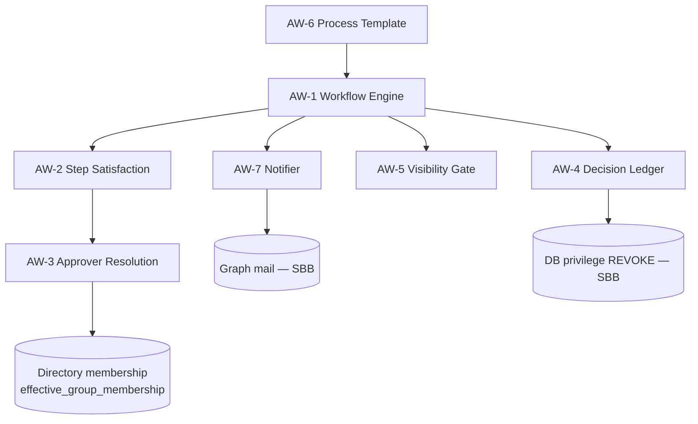

# Building Blocks — Policy Approval Workflow (ABBs & SBBs)

_TOGAF-aligned. An **Architecture Building Block (ABB)** is a product-neutral
capability (function, interfaces, dependencies, standards it must meet). A
**Solution Building Block (SBB)** is the specific product/code that realizes it
here. This extends the platform catalogue in
[`../ARCHITECTURE-BUILDING-BLOCKS.md`](../ARCHITECTURE-BUILDING-BLOCKS.md) with the
blocks this feature introduces._

---

## 1. ABBs introduced by this feature

| ID | ABB (neutral capability) | Function | Key interfaces | Standards / NFRs it must meet |
|----|--------------------------|----------|----------------|-------------------------------|
| **AW-1** | **Sign-off Workflow Engine** | Route an artefact through an ordered set of decision steps and derive a single state | submit / decide / withdraw / status | Deterministic state; per-version; idempotent reads |
| **AW-2** | **Step Satisfaction Policy** | Decide when a step of N approvers is "done" | rule ∈ {all, any, quorum}, required | Total function over any member count; monotonic |
| **AW-3** | **Approver Resolution** | Turn an approver *specification* into a concrete set of identities | resolve(spec) → people | Snapshot semantics; reads identity source of truth |
| **AW-4** | **Immutable Decision Ledger** | Record each decision as tamper-evident evidence | append(decision); read(version) | Append-only (no update/delete); attributable; time-stamped |
| **AW-5** | **Visibility Gate** | Hide an artefact from consumers until authorised | canRead(subject, artefact) | Fail-closed; private-by-default |
| **AW-6** | **Reusable Process Template** | Define a process once, instantiate many times, without coupling instances to edits | author / apply(copy) | Copy-on-apply isolation |
| **AW-7** | **Asynchronous Obligation Notifier** | Tell the right party they must act, at most once per milestone | notify(party, milestone) | Idempotent; non-blocking; config-gated |

## 2. SBBs — how each ABB is realized here

| ABB | Realizing SBB (this project) | Location | Reuse note |
|-----|------------------------------|----------|------------|
| AW-1 Sign-off Workflow Engine | `ctx()` read model + the `submit/decide/withdraw/publish` handlers; `policies.approval_state` + `submitted_at` | `routes/approvals.js` | **Reusable** for any artefact needing ordered sign-off (contracts, change requests, model cards) |
| AW-2 Step Satisfaction Policy | `stepTarget(rule, required, memberCount)` + `satisfied` | `routes/approvals.js` | Reusable pure function |
| AW-3 Approver Resolution | `expandGroups()` reading `effective_group_membership`; `from_group` marker | `routes/approvals.js`, migration 022 | Depends on AW-source (directory sync); snapshot pattern reusable |
| AW-4 Immutable Decision Ledger | `policy_approvals` + `REVOKE update,delete` | migration 019, `docker-grants.sql` | **Highly reusable** — same pattern as `signatures`/`audit_log` (platform ABB "Immutable Audit Ledger") |
| AW-5 Visibility Gate | `canRead` + employee `/policies` predicate (`approved_externally OR published`) | `authz.js`, `routes/policies.js` | Reuses the platform private-by-default ABB |
| AW-6 Reusable Process Template | `approval_workflows*` tables + `apply-workflow` (copy-in) | `routes/approval-templates.js`, migrations 021/022 | Reusable template-instantiation pattern |
| AW-7 Asynchronous Obligation Notifier | `emailOnce`/`notify`/`notifyStep` + `notifications_sent` idempotency | `routes/approvals.js` | Reuses the platform "Notification & Escalation" ABB (B6) + `sendMail` SBB |

## 3. Dependencies between blocks

## 4. Standards & alignment

- **Data integrity:** AW-4 realizes the enterprise "records protection" standard via database privilege, not application discipline — the same standard the platform applies to `signatures` and `audit_log` (ADR-109).
- **Identity:** AW-1/AW-3 consume the enterprise identity ABB (Entra ID delegated tokens; directory as source of truth). No new identity integration or scope.
- **Isolation:** AW-3 (snapshot-at-submit) and AW-6 (copy-on-apply) both express one enterprise pattern — *instantiate by value, not by reference* — so a definition change never mutates a running instance. This is the reusable lesson worth lifting to other workflow domains.

## 5. Portability

If this capability were rebuilt on another stack, the ABBs are the contract to
preserve:

- Swap PostgreSQL privilege-REVOKE (AW-4 SBB) for any store that can enforce
  append-only (e.g. WORM storage, ledger DB) — the ABB requirement is "no
  update/delete, attributable, time-stamped".
- Swap Graph mail (AW-7 SBB) for any notifier — the ABB requires idempotent,
  non-blocking, config-gated delivery.
- Swap the directory view (AW-3 source) for any membership authority — the ABB
  requires point-in-time resolution (snapshot).
