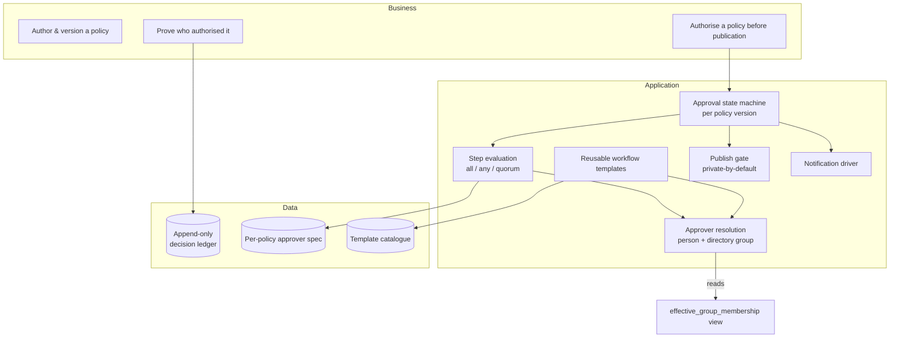
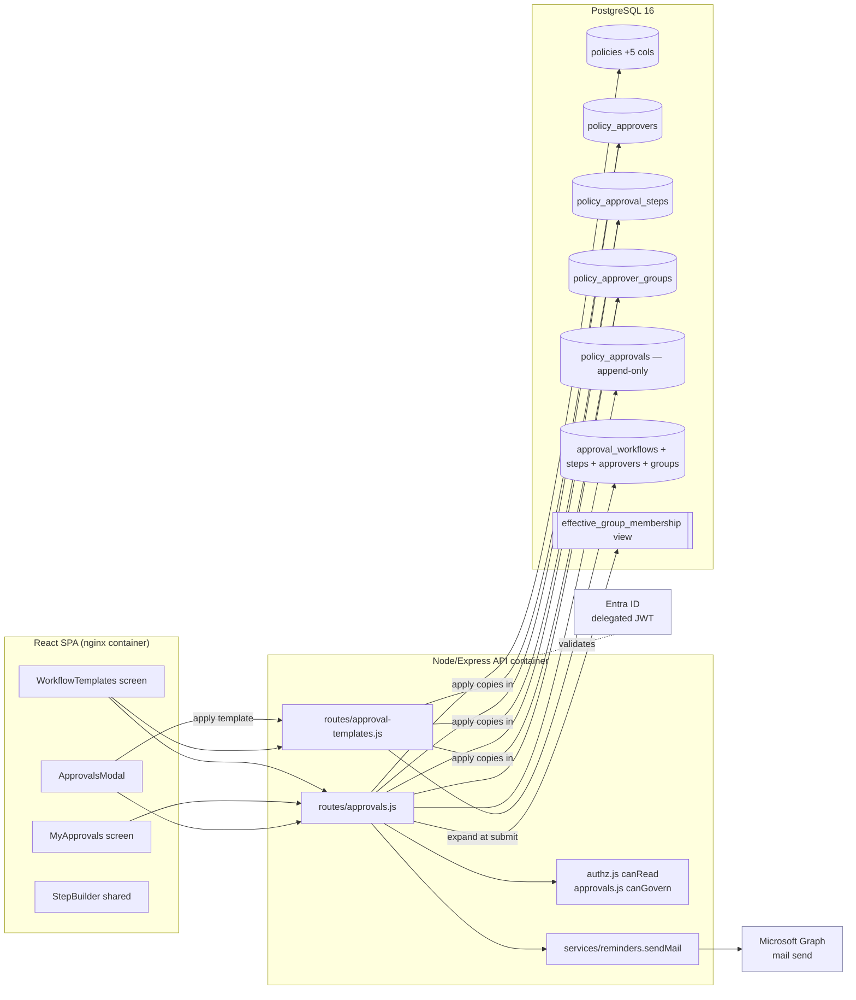
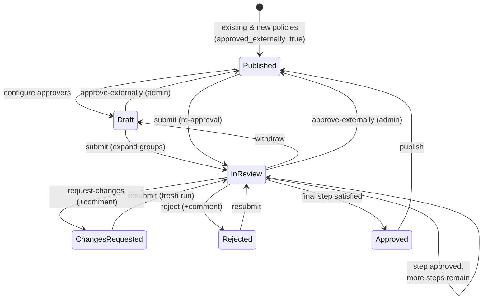
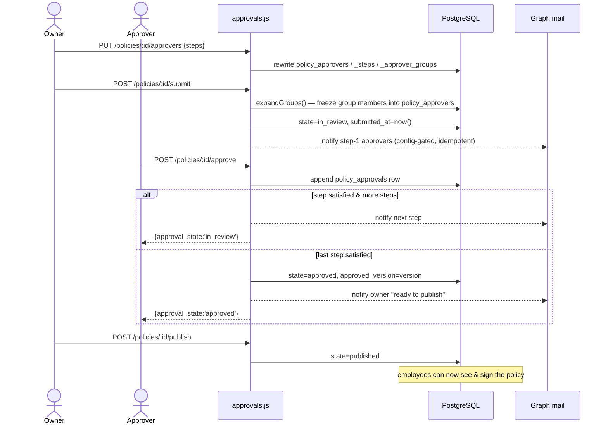

# High-Level Design — Policy Approval Workflow

_Companion: [LLD.md](LLD.md) · [USER-STORIES.md](USER-STORIES.md) ·
[SECURITY-ASSESSMENT.md](SECURITY-ASSESSMENT.md) · ADR-120._

---

## 1. Problem & context

The portal distributes policies and collects binding "read & understood"
acknowledgements. Before this feature, a policy was **assumed already approved
elsewhere** (SharePoint, email, a GRC tool) — there was no in-system record of
*who signed off on the policy itself* before employees were asked to attest to it.
That is a governance gap: the portal could prove employees acknowledged a policy,
but not that the policy was itself authorised.

The approval workflow closes that gap. A policy is now **drafted → routed through
an ordered chain of approvers → approved → published**, and employees only ever
see Approved-and-Published content. The approval record is a first-class,
append-only artefact alongside signatures and the audit log.

### 1.1 Goals

- Per-policy, **per-version** sign-off — a new version re-enters approval, matching the existing "new version ⇒ re-sign" rule.
- Ordered **steps**; each step is one or more approvers with a satisfaction rule (**all / any / quorum**).
- Approvers targeted by **person** or by **directory group** (resolved to members).
- Six states: Draft, In Review, Changes Requested, Rejected, Approved, Published.
- A **publish gate**: unapproved policies are invisible to employees (reuses private-by-default).
- **Reusable templates** so a standard chain (e.g. Infra → CISO → CTO) is defined once and applied to many policies.
- An **append-only decision ledger** — the same integrity model as `signatures` / `audit_log`.
- **Backward compatible**: every existing policy stays visible; approval is opt-in per policy.

### 1.2 Non-goals (deliberate)

- **Cryptographically signed approvals** — the append-only ledger + token-bound identity matches the existing evidence model; deferred.
- **Fully dynamic group membership** — a group is *frozen at submit* (snapshot), not re-evaluated live. See ADR-120-c.
- **Owner/submitter auto-exclusion** — if the owner belongs to an approver group they are a valid approver, exactly as if named. See ADR-120-d.
- **Approving in an external GRC tool** — the escape hatch (`approve-externally`) records that it happened, but the portal is the system of record for in-portal runs.

---

## 2. Capability decomposition

These map to the Architecture Building Blocks catalogued in
[BUILDING-BLOCKS.md](BUILDING-BLOCKS.md).

---

## 3. Container / component view

The feature adds no new deployable unit. It is code inside the existing API
container and SPA, plus tables in the existing PostgreSQL.

- **`routes/approvals.js`** — the state machine: configure, submit (with group expansion), decide, withdraw, publish, approve-externally, status, pending queue, notifications.
- **`routes/approval-templates.js`** — template CRUD (admin) + `apply-workflow`.
- **`routes/approvals.js`** — `canGovern` (owner/admin drive the flow); **`authz.js`** — the `canRead` publish gate.
- **`StepBuilder`** — one shared editor used by both the per-policy modal and the template screen.

---

## 4. The state machine

Key invariants:

- **Per version.** `approved_version` records which version was approved; a new version drops back out of "approved" until re-approved.
- **Run = since submit.** A decision counts toward the current run only if `decided_at ≥ submitted_at`. Withdraw/resubmit starts a fresh run without deleting the prior evidence.
- **Publish gate.** Employees see a policy only when `approved_externally OR approval_state='published'`. Owners, admins, and configured approvers can always see it (so they can act). See [LLD §7](LLD.md#7-authorization--the-publish-gate).
- **Escape hatch.** `approve-externally` (admin only) sets `approved_externally=true` + `published` for policies signed off outside the portal.

---

## 5. Request lifecycle (submit → approve → publish)

---

## 6. Integration points

| Integration | How | Notes |
|-------------|-----|-------|
| **Entra ID** | Delegated JWT on every request (existing `requireAuth`); `req.user.oid`, roles | No app-only tokens; no new scope for this feature |
| **Microsoft Graph (mail)** | `services/reminders.sendMail` | Reused; notifications are **no-op unless `GRAPH_MAIL_SENDER` is set** |
| **Directory sync** | Reads the `effective_group_membership` view (populated by SCIM push or AU-scoped `GroupMember.Read.All`) | **No new registration scope** — membership already in the DB mirror |
| **Policy library** | `approval_state` surfaced on policy cards; publish gate in the employee `/policies` query | Backward compatible |
| **Audit log** | Every mutation writes an `audit_log` row (`policy.approval.*`, `approval.workflow.*`) | Append-only |

---

## 7. Non-functional requirements

| NFR | Target | How met |
|-----|--------|---------|
| **Integrity** | Approval decisions cannot be altered/deleted | `REVOKE update, delete on policy_approvals` (DB-enforced), corrections are new rows |
| **Confidentiality** | Draft/in-review policies invisible to employees | Publish gate in `canRead` + employee `/policies` query |
| **Availability** | Notification failure must not fail a decision | Notifications are fire-and-forget (`notify()` swallows errors) |
| **Auditability** | Who decided what, when, on which version | `policy_approvals` (version + step + oid + decision + comment + timestamp) + `audit_log` |
| **Backward compatibility** | Existing policies unaffected | Migration defaults: `approval_state='published'`, `approved_externally=true` |
| **Performance** | Status/pending are cheap | Indexed by `(policy_id, policy_version, decided_at)`; pending iterates only in-review policies |
| **Least privilege** | No new external permission | Group expansion reads an existing DB view |
| **Testability** | Behaviour provable | 22 integration tests across 3 files (see [USER-STORIES §traceability](USER-STORIES.md#5-traceability-matrix)) |

---

## 8. Design principles applied

1. **Append-only for evidence.** Decisions join `signatures`/`audit_log` as immutable ledgers; DB grants enforce it, not application code.
2. **Private-by-default reuse.** The publish gate is the existing visibility model, not a new access system.
3. **Snapshot over reference.** Both templates (copy-in) and groups (expand-at-submit) freeze a run's definition, so edits elsewhere never mutate an in-flight run. This is the single most important consistency decision — it keeps the ledger meaningful.
4. **Opt-in & backward compatible.** Nothing changes until a policy is explicitly submitted.
5. **Config-gated side effects.** Email is inert unless configured; the core flow never depends on it.
