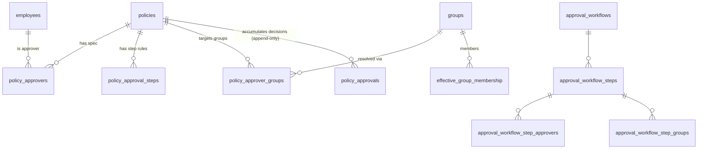

# Low-Level Design — Policy Approval Workflow

_Implementation reference. Companion: [HLD.md](HLD.md) · ADR-120._
_Source: `apps/api/src/routes/approvals.js`, `approval-templates.js`, `authz.js`;
migrations 019–022; `apps/web/src/components/approvals.jsx`, `workflows.jsx`._

---

## 1. Data model

### 1.1 `policies` — five added columns (migration 019)

| Column | Type | Default | Meaning |
|--------|------|---------|---------|
| `approval_state` | text, CHECK in (draft, in_review, changes_requested, rejected, approved, published) | `published` | Current lifecycle state |
| `approved_externally` | boolean | `true` | Approved outside the portal (or never routed) — visible to employees |
| `approved_version` | text | null | The version that reached Approved |
| `submitted_at` | timestamptz | null | Start of the current run |
| `submitted_by` | uuid → employees(oid) | null | Who submitted |

Defaults make **every existing and new policy `published`/`approved_externally`** — inert until explicitly submitted.

### 1.2 Approver spec

```sql
-- migration 019 (PK widened in 020); from_group added in 022
policy_approvers (
  policy_id uuid, position int, approver_oid uuid → employees(oid),
  from_group uuid → groups(id) ON DELETE SET NULL,   -- NULL = named; set = expanded from a group at submit
  PRIMARY KEY (policy_id, position, approver_oid)
)
-- migration 020
policy_approval_steps (
  policy_id uuid, position int,
  rule text CHECK in (all, any, quorum) DEFAULT 'all',
  required int,                                        -- quorum count (else NULL)
  PRIMARY KEY (policy_id, position)
)
-- migration 022
policy_approver_groups (
  policy_id uuid, position int, group_id uuid → groups(id),
  PRIMARY KEY (policy_id, position, group_id)
)
```

A **step** = one `position`. It carries a rule (`policy_approval_steps`), zero+
named people (`policy_approvers` with `from_group IS NULL`), and zero+ groups
(`policy_approver_groups`). At submit, groups expand into `policy_approvers` rows
with `from_group` set.

### 1.3 Decision ledger (append-only)

```sql
-- migration 019
policy_approvals (
  id bigserial PK,
  policy_id uuid, policy_version text,
  step_position int,
  approver_oid uuid → employees(oid),
  decision text CHECK in (approved, rejected, changes_requested),
  comment text,
  decided_at timestamptz DEFAULT now()
)
CREATE INDEX ON policy_approvals (policy_id, policy_version, decided_at);
-- docker-grants.sql:
REVOKE update, delete ON policy_approvals FROM governance_app;
```

The `REVOKE` is the integrity control: the app role can only `INSERT`/`SELECT`.
Corrections are new rows.

### 1.4 Reusable templates (migrations 021 + 022)

```sql
approval_workflows (id bigserial PK, name, description, active bool DEFAULT true,
                    created_by uuid, created_at, updated_at)
approval_workflow_steps (workflow_id bigint, position int, rule, required,
                         PRIMARY KEY (workflow_id, position))
approval_workflow_step_approvers (workflow_id, position, approver_oid,
                         PK (workflow_id, position, approver_oid),
                         FK (workflow_id, position) → approval_workflow_steps)
approval_workflow_step_groups (workflow_id, position, group_id,
                         PK (workflow_id, position, group_id),
                         FK (workflow_id, position) → approval_workflow_steps)
```

Workflow ids are **bigints**, so template routes use the `:wfId` path param
(the shared router validates `:id` as a UUID — see `routes/index.js`).

### 1.5 ERD



---

## 2. The `ctx(policyId)` derivation

`ctx()` is the single read model every endpoint builds on. It returns
`{ p, steps, decisions, currentStep }`.

**Algorithm:**

1. Load the policy row (state, version, owner, submitted_at, …).
2. Load approver rows (people, with `from_group` + display name), group rows (with group name), and step-rule rows.
3. Load `policy_approvals` for the **current version**, ordered by `decided_at`.
4. **Run filter:** `inRun(d) = !submitted_at || decided_at ≥ submitted_at`. Build `approvedByPos: position → Set(approver_oid)` from `approved` decisions that are `inRun`.
5. **Positions** = sorted union of step-rule positions ∪ people positions ∪ group positions (union is defensive — a group-only step has no people until submit).
6. For each position build a **step**: `{ position, rule, required (=stepTarget), approvers[], groups[], approvedOids[], satisfied }`.
7. `currentStep` = first step with `!satisfied` **iff** `approval_state='in_review'` (else `null`).

**Step target (satisfaction threshold):**

```
stepTarget(rule, required, memberCount) =
  rule === 'any'    → 1
  rule === 'quorum' → min(max(required,1), memberCount)
  otherwise ('all') → memberCount
satisfied = |approvedOids| ≥ target
```

Because groups are expanded into `policy_approvers` **before** any decision is
possible (at submit), `memberCount` is always the resolved person count — so the
whole satisfaction calculation is person-based and rule-agnostic to how the
people got there.

---

## 3. Group expansion (`expandGroups`, snapshot-at-submit)

Run inside `POST /submit`, before flipping to `in_review`:

```sql
-- 1. clear any prior run's expansion
DELETE FROM policy_approvers WHERE policy_id=$1 AND from_group IS NOT NULL;
-- 2. for each (position, group_id) in policy_approver_groups:
INSERT INTO policy_approvers (policy_id, position, approver_oid, from_group)
  SELECT $policy, $position, m.employee_oid, $group_id
    FROM effective_group_membership m
    JOIN employees e ON e.oid = m.employee_oid
   WHERE m.group_id = $group_id AND coalesce(e.status,'Active') <> 'Inactive'
  ON CONFLICT (policy_id, position, approver_oid) DO NOTHING;
```

- **Snapshot:** members are frozen into the run. A later membership change does nothing until the next submit.
- **De-dup:** a person named directly (`from_group IS NULL`) and also in the group → the `ON CONFLICT` keeps the named row; counted once.
- **Inactive filter:** former/disabled employees are excluded.
- **Empty-group guard:** after expansion, `submit` rejects if any step has zero resolved approvers (`no_approvers`, naming the step).
- **Fresh on resubmit:** step 1 (DELETE) means a changes-requested → resubmit re-resolves membership.

---

## 4. `decide()` — approve / reject / request-changes

```
c = ctx(id)
guard: state=in_review AND currentStep exists      else 409 bad_state
guard: caller ∈ currentStep.approvers OR isAdmin   else 403 not_pending_approver
guard: approve & caller already in approvedOids     → 409 bad_state (already approved)
guard: (reject|changes) require non-empty comment   else 400 comment_required
INSERT policy_approvals (…, step_position=currentStep.position, decision, comment)
decision = rejected            → state = rejected
decision = changes_requested   → state = changes_requested
decision = approved:
    nowApproved = |approvedOids ∪ {caller}|
    if nowApproved ≥ currentStep.required:
        later = steps with position > current
        if none  → state = approved, approved_version = version
        else     → state = in_review, nextStep = later[0]
UPDATE policies SET approval_state=…(and approved_version if approved)
audit('policy.approval.<decision>')
notify: nextStep approvers (advance) OR owner (approved/rejected/changes)
```

Admin override: an admin can decide on any current step; their vote counts as one
distinct approver toward the rule.

---

## 5. API reference

All routes require a valid delegated Entra token (`requireAuth`). `:id` is a
policy UUID; `:wfId` is a template bigint. Errors are `{ error, detail? }`; the
codes map to friendly messages in [`errors.js`](../../apps/web/src/errors.js) and
[`TROUBLESHOOTING.md`](../TROUBLESHOOTING.md).

### 5.1 Per-policy workflow (`routes/approvals.js`)

| Method & path | Who | Body | Success | Notable errors |
|---------------|-----|------|---------|----------------|
| `PUT /policies/:id/approvers` | owner/admin | `{approverOids[]}` **or** `{steps:[{approverOids,groupIds,rule,required}]}` | `{ok,steps,approvers,groups}` | 409 `bad_state` if in_review |
| `POST /policies/:id/submit` | owner/admin | — | `{ok,approval_state:'in_review'}` | 400 `no_approvers`; 409 `bad_state` |
| `POST /policies/:id/approve` | current approver / admin | `{comment?}` | `{ok,approval_state}` | 403 `not_pending_approver`; 409 `bad_state` |
| `POST /policies/:id/reject` | current approver / admin | `{comment}` | `{ok,approval_state:'rejected'}` | 400 `comment_required` |
| `POST /policies/:id/request-changes` | current approver / admin | `{comment}` | `{ok,approval_state:'changes_requested'}` | 400 `comment_required` |
| `POST /policies/:id/withdraw` | owner/admin | — | `{ok,approval_state:'draft'}` | 409 `bad_state` |
| `POST /policies/:id/publish` | owner/admin | — | `{ok,approval_state:'published'}` | 409 `not_approved` |
| `POST /policies/:id/approve-externally` | admin | — | `{ok,approval_state:'published'}` | 403 `forbidden` |
| `GET /policies/:id/approvals` | any authed | — | status object (below) | 404 `not_found` |
| `GET /approvals/pending` | any authed | — | `[{id,name,version,submitted_at}]` | — |

**`GET /policies/:id/approvals` response:**

```jsonc
{
  "approval_state": "in_review",
  "approved_version": null,
  "steps": [
    { "position": 1, "rule": "any", "required": 1,
      "approvers": [ { "oid": "…", "name": "…", "from_group": null } ],
      "groups": [ { "id": "…", "name": "Security" } ],
      "approvedOids": [], "satisfied": false }
  ],
  "currentStep": { "position": 1, … },
  "decisions": [ { "step_position": 1, "approver_oid": "…", "decision": "approved", "comment": null, "decided_at": "…" } ],
  "canAct": true,      // caller is a current-step approver (or admin) & hasn't approved yet
  "canGovern": true    // caller is owner or admin
}
```

### 5.2 Templates (`routes/approval-templates.js`)

| Method & path | Who | Notes |
|---------------|-----|-------|
| `GET /approval-workflows` | admin | list with steps (people + groups) |
| `GET /approval-workflows/:wfId` | admin | one template |
| `POST /approval-workflows` | admin | `{name, description?, steps:[…]}` → 201 with the created template; 400 `name_required` |
| `PUT /approval-workflows/:wfId` | admin | update name/description/active and (if `steps` present) replace steps |
| `DELETE /approval-workflows/:wfId` | admin | cascades to steps; **does not touch policies it was applied to** |
| `POST /policies/:id/apply-workflow` | owner/admin | `{workflowId}` → **copies** the template's people + groups into the policy spec; 409 `bad_state` if in_review; 400 `no_approvers` if the template is empty |

**Copy-in semantics:** `apply-workflow` deletes the policy's current spec and
re-inserts the template's steps/people/groups. From that point the policy owns its
own copy — editing or deleting the template never changes the policy.

---

## 6. Notifications (`emailOnce` / `notify` / `notifyStep`)

- **Config-gated:** `emailOnce` returns immediately unless `cfg.graph.mailSender` is set.
- **Idempotent:** keyed on `notifications_sent (policy_id, user_oid, milestone, policy_version)` with `ON CONFLICT DO NOTHING`; milestone is `approval:step:<pos>` (per approver) or `approval:<state>` (owner).
- **Fire-and-forget:** `notify(fn) = Promise.resolve().then(fn).catch(()=>{})` — a mail failure never fails or blocks the decision.
- **Triggers:** submit → all step-1 approvers; step advances → all next-step approvers; terminal (approved/rejected/changes) → the owner.

---

## 7. Authorization & the publish gate

`routes/approvals.js` + `authz.js`:

- **`canGovern(req, p)`** (defined in `routes/approvals.js`) = `isAdmin(req) || p.owner_oid === req.user.oid`. Gates configure/submit/withdraw/publish/apply-template.
- **`canRead`** (exported from `authz.js`) returns true for **admin**, **owner**, or a **configured approver** (row in `policy_approvers`); otherwise requires `approved_externally OR approval_state='published'` before the normal effective-membership check.
- The employee `GET /policies` query carries the same predicate: `... AND (p.approved_externally OR p.approval_state = 'published')`.

Net effect: a policy under review is invisible to employees but visible to the
people who must act on it. See [SECURITY-ASSESSMENT §RBAC](SECURITY-ASSESSMENT.md#3-rbac-matrix).

---

## 8. Frontend contract

| Component (`apps/web/src/components/`) | Role |
|---|---|
| `approvals.jsx` → `ApprovalBadge` | State chip (colour per state) on policy cards + modal |
| `approvals.jsx` → `ApprovalsModal` | Per-policy: chain view, decision panel, step config, apply-template picker, governance actions |
| `approvals.jsx` → `MyApprovals` | "My approvals" screen — list from `/approvals/pending` |
| `approvals.jsx` → `StepBuilder` (shared, exported) | Ordered step editor: rule select, quorum count, person picker, group picker |
| `approvals.jsx` → `stepsToPayload` / `ruleLabel` (exported) | Normalize builder state → API; human rule label |
| `workflows.jsx` → `WorkflowTemplates` | Admin screen: template CRUD, reuses `StepBuilder` |

**Builder ↔ spec mapping.** `ApprovalsModal` initializes the builder from the
SPEC only — `approverOids` = approvers with `from_group == null`, `groupIds` =
`step.groups`. The chain view instead shows the *resolved* people (including
group-expanded ones, tagged "via group"). This keeps editing (spec) and display
(resolved run) cleanly separated.

**Nav wiring (`app.jsx`):** *My approvals* (admin + manager), *Approval workflows*
(admin). Self-loading screens need no `loadView` branch.

---

## 9. Migration & test wiring

- **Migrations** registered in `db/migrate.js`, the docker-compose initdb mounts, and `test/helpers/db.js` (FILES + DATA_TABLES) — all four (019–022) in order.
- **Grants:** new tables are covered by the blanket grant in `docker-grants.sql`; only `policy_approvals` is revoked update/delete.
- **Tests:** `test/integration/approvals.test.js` (state machine + groups all/any/quorum), `approval-templates.test.js` (CRUD/apply/snapshot), `approval-groups.test.js` (directory-group snapshot). 22 tests; see [USER-STORIES §5](USER-STORIES.md#5-traceability-matrix).
